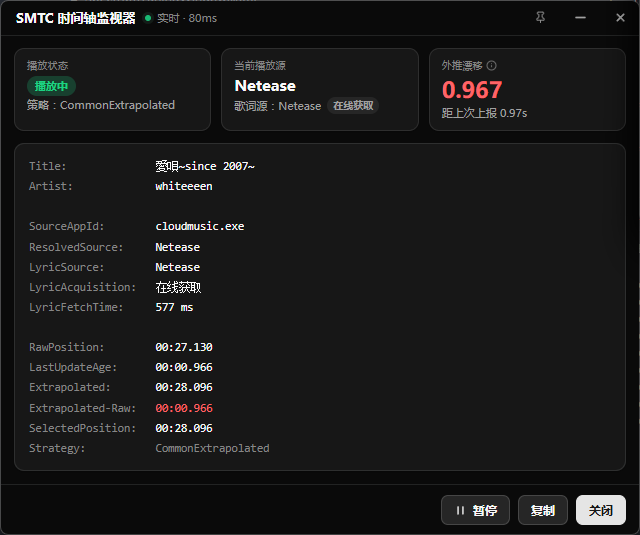
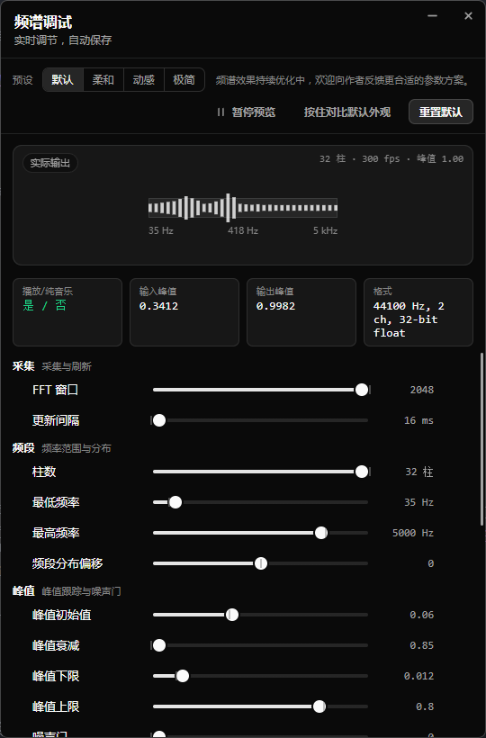
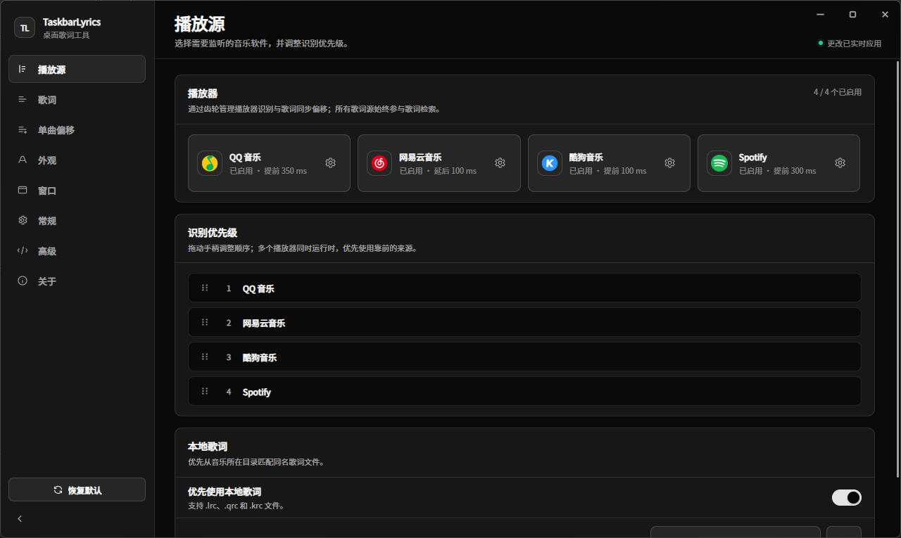
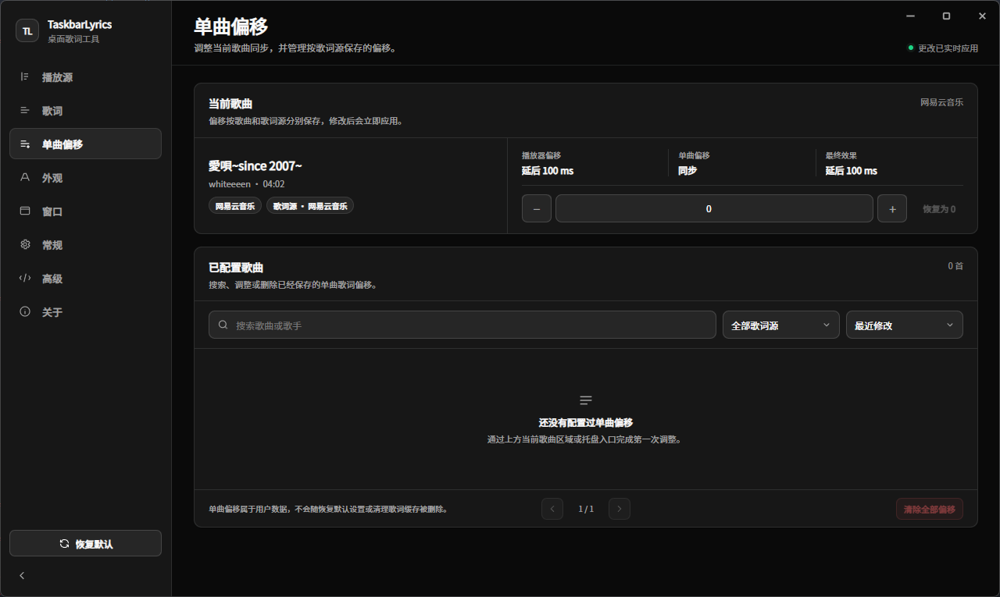

# TaskbarLyrics

TaskbarLyrics 是一款 Windows 任务栏歌词工具。播放音乐时，它会自动识别当前歌曲，并把同步歌词显示在任务栏的闲置区域。

无需为每个播放器分别配置歌词插件。程序会自动从多个歌词来源中寻找合适结果，也支持读取本地歌词。

存在由 [sorawithcat](https://github.com/sorawithcat) 维护的原生 WPF 轻量版本，不依赖 WebView2 / Chromium，牺牲部分视觉效果，换取较少的进程数、内存占用和发布体积
- [TaskbarLyrics-Light README](https://github.com/sorawithcat/TaskbarLyrics/blob/main/TaskbarLyrics.Light/README.md)

## 主版本效果预览

歌词演示字体为程序内置的 Source Han Sans SC，无需单独安装。

<p align="center">
  
  
  
</p>

<p align="center">
  
  
</p>


## 主要功能

- 双行任务栏歌词与平滑切换动画
- 自动识别正在播放的歌曲
- QQ 音乐、网易云音乐、酷狗音乐和 LRCLIB 多来源歌词匹配
- 本地 `.lrc`、`.qrc`、`.krc` 及部分音频文件内嵌歌词
- 歌词翻译显示（优化中）
- 纯音乐、无歌词或指定场景下显示实时频谱
- 歌词偏移调整
- 自定义字体、字号、颜色、阴影和歌曲封面
- 自定义歌词窗口宽度、位置、背景和置顶行为
- 多个播放器同时运行时设置识别优先级
- 托盘后台运行、开机启动和新版本检查

## 支持的播放器

| 播放器 | 支持情况 | 使用提示 |
| --- | --- | --- |
| QQ 音乐 | 支持 | 通常可以获得较完整的歌曲信息和播放进度 |
| 网易云音乐 | 支持 | 原生歌曲信息有时不完整，可安装 [inflink-rs](https://github.com/apoint123/inflink-rs) 改善识别效果 |
| 酷狗音乐 | 有限支持 | 部分版本不能提供可靠播放进度，可能只能识别歌曲而无法滚动歌词；也可尝试 [MoeKoeMusic](https://github.com/MoeKoeMusic/MoeKoeMusic) |
| Spotify | 支持 | 歌词由可用的在线歌词来源自动匹配 |
| 其他播放器 | 视播放器而定 | 只要播放器能向 Windows 提供歌曲信息和播放进度，就有机会正常使用 |

如果多个播放器同时运行，可以在“设置 → 播放源”中启用或停用播放器，并拖动调整识别顺序。

## 下载与安装

### 从 Release 安装

1. 前往 [Releases](https://github.com/ANYNC/TaskbarLyrics/releases) 下载最新版本压缩包。
2. 将压缩包完整解压到一个普通文件夹。
3. 运行 `TaskbarLyrics.exe`。
4. 程序启动后会常驻系统托盘，可从托盘菜单显示歌词或打开设置。

请不要只复制或单独运行 EXE。发布包中的 `Assets`、`Web` 等目录也是程序正常运行所需的文件。

### 系统要求

- Windows 10/11 x64
- 下载独立版压缩包时，无需额外安装 .NET 8 Runtime
- 如果设置页或歌词窗口为空白，请安装 Microsoft Edge WebView2 Runtime

## 快速使用

1. 启动 TaskbarLyrics。
2. 打开受支持的音乐播放器并播放一首歌曲。
3. 如果歌词没有显示，右键或点击托盘图标，选择“显示/隐藏歌词”。
4. 打开“设置 → 播放源”，确认正在使用的播放器已经启用。
5. 在“外观”和“窗口”页面调整字体、封面、宽度和任务栏位置。
6. 如果歌词提前或延后，在播放器设置或“单曲偏移”页面进行校准。

所有主要外观设置都会即时应用，可以一边调整一边查看任务栏中的实际效果。

## 歌词来源与本地歌词

TaskbarLyrics 会优先尝试与当前播放器对应的歌词来源。如果没有找到合适歌词，会继续从其他来源中自动匹配。

当前使用的在线歌词来源包括：

- QQ 音乐
- 网易云音乐
- 酷狗音乐
- LRCLIB

使用本地歌词时，在“设置 → 播放源”中开启“优先使用本地歌词”，并添加本地音乐目录。支持：

- `.lrc`
- `.qrc`
- `.krc`
- 部分音频文件中内嵌的歌词

建议让歌词文件与歌曲文件使用相同或接近的文件名。程序也会尝试根据歌曲标题和歌手进行匹配。

内嵌歌词需要包含可用于同步滚动的 LRC 时间标签。程序目前会尝试读取 `LYRICS`、`SYNCEDLYRICS` 和 `UNSYNCEDLYRICS` 标签，但不同音乐管理软件写入歌词的方式并不统一，因此不能保证所有音频格式和标签都能识别。如果读取失败，建议把歌词导出为与歌曲同名的 `.lrc` 文件。更详细的兼容范围见[常见问题：本地歌词没有被识别](docs/常见问题与故障排查.md#9-本地歌词没有被识别)。

歌词翻译取决于具体歌词来源，并非所有歌曲都能获得翻译。

## 频谱显示

频谱可以在任务栏歌词区域显示当前系统音频的变化。可在“设置 → 歌词”或托盘菜单中选择：

- 关闭
- 仅纯音乐时显示
- 纯音乐或没有找到歌词时显示
- 始终显示

如果频谱没有反应，请先确认歌曲正在播放、频谱没有关闭，并检查 Windows 当前使用的音频输出设备。

## 歌词同步调整

项目提供两种歌词偏移：

- **播放器偏移**：修正某个播放器普遍存在的提前或延后。适合先进行整体校准。
- **单曲偏移**：只修正某一首歌曲，并按歌词来源分别保存。适合处理个别歌曲的时间轴差异。

推荐先调整播放器偏移；只有个别歌曲仍然不同步时，再设置单曲偏移。

托盘菜单中的“调整当前歌曲偏移”可以直接打开当前歌曲的校准页面。

## 常见问题

歌词窗口不显示、播放器无法识别、歌词不同步或频谱没有反应时，请查看：

**[常见问题与故障排查](docs/常见问题与故障排查.md)**

## 数据位置与卸载

用户数据默认保存在：

| 数据 | 位置 |
| --- | --- |
| 设置 | `%APPDATA%\TaskbarLyrics\settings.json` |
| 歌词缓存 | `%APPDATA%\TaskbarLyrics\cache` |
| 歌曲映射和单曲偏移 | `%APPDATA%\TaskbarLyrics\database` |
| 日志 | 程序目录下的 `Logs` 文件夹 |

清理歌词缓存不会删除应用设置或单曲偏移。恢复默认设置也不会删除已经保存的单曲偏移。

程序无需传统安装。退出程序并删除解压目录即可移除程序文件；如果希望同时删除所有个人设置和缓存，再删除 `%APPDATA%\TaskbarLyrics`。

为了在线匹配歌词，程序会把当前歌曲的标题、歌手、专辑或时长等信息发送给相应歌词服务。自动检查更新时会访问 GitHub Release。

## 相关文档

面向用户：

- [常见问题与故障排查](docs/常见问题与故障排查.md)

面向开发和维护者：

- [功能与技术说明](docs/功能与技术说明.md)
- [频谱调节参数说明](docs/频谱调节参数说明.md)

<details>
<summary><strong>从源码运行、验证与自行发布</strong></summary>

从源码运行需要 Windows x64、.NET 8 SDK 和 Windows 11 SDK 10.0.22621。

```powershell
dotnet restore
dotnet run --project TaskbarLyrics.App
```

常用开发重启脚本：

```powershell
powershell -ExecutionPolicy Bypass -File scripts/restart-app.ps1
```

构建项目：

```powershell
dotnet build TaskbarLyrics.sln
```

修改设置页后运行设置契约测试：

```powershell
powershell -ExecutionPolicy Bypass -File TaskbarLyrics.App/Web/Settings/settings-contract.tests.ps1
```

### 自行发布

独立发布：

```powershell
dotnet publish TaskbarLyrics.App/TaskbarLyrics.App.csproj -c Release -r win-x64 --self-contained true -p:DebugType=None -p:DebugSymbols=false -o publish/win-x64
```

单文件压缩发布：

```powershell
dotnet publish TaskbarLyrics.App/TaskbarLyrics.App.csproj -c Release -r win-x64 --self-contained true -p:PublishSingleFile=true -p:EnableCompressionInSingleFile=true -p:DebugType=None -p:DebugSymbols=false -o publish/single-compressed
```

一键生成版本目录和 ZIP 发布包：

```powershell
powershell -ExecutionPolicy Bypass -File scripts/publish-release.ps1
```

也可以直接传入版本号；同版本产物已存在时，需要显式使用 `-Force` 覆盖：

```powershell
powershell -ExecutionPolicy Bypass -File scripts/publish-release.ps1 -Version 1.2.0
powershell -ExecutionPolicy Bypass -File scripts/publish-release.ps1 -Version 1.2.0 -Force
```

</details>

## 致谢

歌词检索与匹配思路参考了 [BetterLyrics](https://github.com/jayfunc/BetterLyrics)，并结合任务栏实时显示场景进行了调整。

## 项目支持

如果这个项目对你有所帮助，欢迎：

- ⭐ Star 项目
- 🐞 提交 Issue 或功能建议
- ☕ 赞助支持项目持续开发


感谢你的支持！❤️

## 许可证

本项目使用 [MIT License](LICENSE)。
