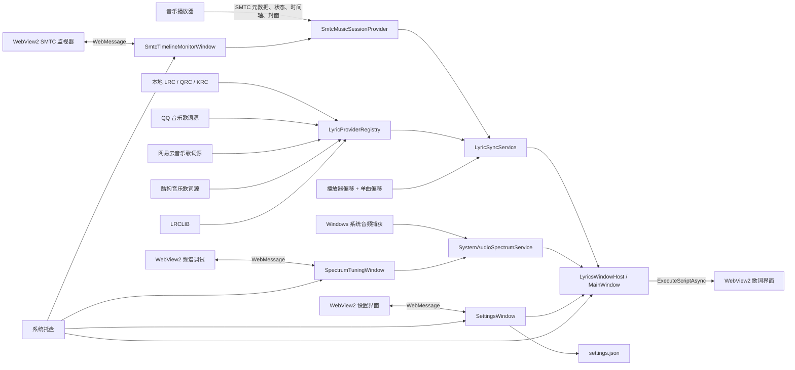
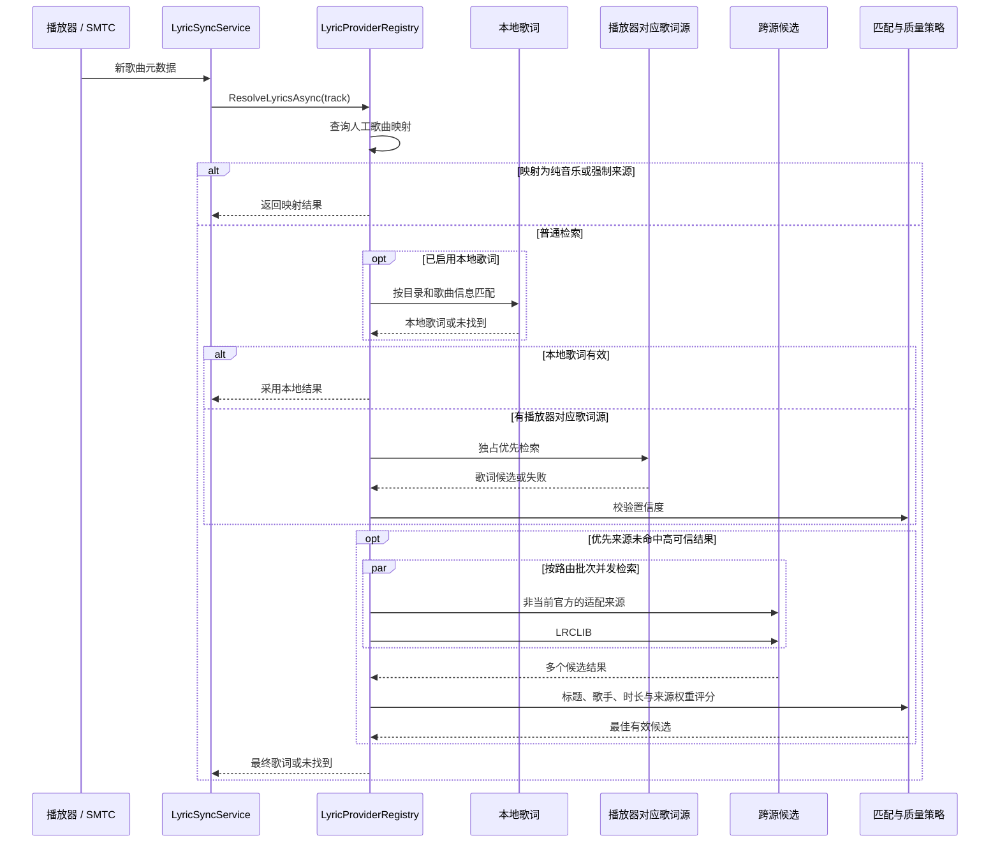

# TaskbarLyrics 功能与技术说明

> 文档状态：基于当前 `main` 分支实现整理  
> 适用对象：普通用户、产品与文档维护者、开发者，以及需要理解或修改本项目的 AI 代理

## 1. 产品概述

TaskbarLyrics 是一款 Windows 任务栏歌词工具。它通过 Windows 系统媒体传输控制接口（SMTC）识别当前播放的歌曲，在本地或多个在线歌词源中寻找高可信歌词，再将同步歌词、歌曲封面或实时音频频谱显示在任务栏闲置区域。

产品的主要目标是：

- 不要求播放器安装专用歌词插件，优先复用播放器向 Windows 提供的媒体信息。
- 在多个歌词源之间自动检索和选择，减少用户手工搜索。
- 让歌词窗口尽量贴合任务栏，同时提供足够的外观、位置和同步校准能力。
- 在纯音乐或没有歌词时，用实时频谱继续利用任务栏显示区域。

当前主版本运行于 Windows 10/11 x64，使用 .NET 8、WPF 和 WebView2。歌词窗口、设置页、SMTC 时间轴监视器和频谱调试窗口的实际内容由 HTML、CSS 和 JavaScript 渲染，WPF 负责窗口托管、系统集成和原生能力调用。

## 2. 系统结构

### 2.1 总体架构



### 2.2 项目分层

| 层级 | 主要职责 | 关键位置 |
| --- | --- | --- |
| `TaskbarLyrics.Core` | 歌词提供者、检索路由、匹配评分、歌词同步、缓存、歌曲映射与单曲偏移 | `TaskbarLyrics.Core/` |
| `TaskbarLyrics.App` | WPF 宿主、SMTC、系统音频、窗口、托盘、设置、更新和单实例 | `TaskbarLyrics.App/` |
| 歌词 Web UI | 双行歌词、封面、动画和频谱渲染 | `TaskbarLyrics.App/Web/Lyrics/` |
| 设置 Web UI | 设置导航、控件、状态和原生消息桥 | `TaskbarLyrics.App/Web/Settings/` |
| 诊断 Web UI | SMTC 时间轴观测、歌词获取诊断和频谱实时调参 | `TaskbarLyrics.App/Web/SmtcMonitor/`、`TaskbarLyrics.App/Web/SpectrumTuning/` |

技术边界：歌词窗口运行在独立 STA 线程上，跨线程访问必须通过 `LyricsWindowHost` 所在线程的 `Dispatcher` 调度，不能从主 UI 线程直接操作内部窗口实例。设置页和两个诊断窗口使用各自的 WebView2 控件；窗口关闭时会取消事件订阅、停止窗口定时器并释放 WebView2，避免已关闭的工具窗口继续保留自己的渲染资源。WebView2 本身采用多进程架构，因此任务管理器中可能出现渲染、GPU 等辅助进程，这不等同于应用被重复启动。

## 3. 播放器识别

### 3.1 用户功能

- 自动识别当前正在播放的歌曲。
- 内置识别 QQ 音乐、网易云音乐、酷狗音乐和 Spotify。
- 可以读取其他支持 SMTC 协议的播放器。
- 可分别启用或停用四个内置播放器。
- 多个播放器同时运行时，可调整播放器识别优先级。
- 获取歌曲标题、歌手、专辑、时长、播放状态、播放位置和封面。
- 支持针对不同播放器设置固定歌词时间偏移。

播放器开关只控制是否识别对应的 SMTC 会话，不是歌词源开关。QQ 音乐、网易云音乐、酷狗音乐和 LRCLIB 在线提供者会保持注册，以便当前播放器的官方来源失败后仍能参与跨源回退；本地歌词则由独立的“启用本地歌词”设置控制。

### 3.2 技术说明

`SmtcMusicSessionProvider` 通过 `GlobalSystemMediaTransportControlsSessionManager` 枚举 Windows 媒体会话。选择会话时，优先考虑已启用、正在播放且排序更靠前的播放器；没有完整会话时，代码包含有限的进程状态回退处理。

除常规媒体属性外，程序还会尝试从 SMTC `Genres` 中读取播放器插件写入的服务歌曲 ID：网易云使用 `NCM-` 前缀，QQ 音乐使用 `QQ-` 前缀。只有确实取得该 ID 时，对应官方提供者才会跳过搜索并直接拉取歌词；普通播放器通常只提供标题、歌手、专辑和时长。

SMTC 上报的时间轴更新频率并不稳定。程序不会只使用最后一次静态位置，而是结合播放状态、时间轴更新时间和当前时间外推播放位置。时间轴策略由 `ITimelinePositionStrategy` 及其注册表封装，便于针对播放器差异进行处理。

播放器级偏移由 `AppSettings.PlayerSources` 保存，最终与外推后的播放位置合并。允许范围为 `-5000～5000 ms`。

限制与兼容性：

- 播放器必须向 Windows 暴露足够的 SMTC 信息，才能获得可靠的歌曲身份和滚动时间轴。
- 网易云音乐原生 SMTC 元数据可能不完整，可借助兼容插件改善。
- 酷狗音乐在部分版本中只能提供不完整时间轴，因此可能只能识别歌曲而无法可靠滚动。
- Spotify 是播放器适配项，不是独立歌词源；其歌词通过通用跨源检索获取。

## 4. 歌词获取

### 4.1 用户功能

- 支持 QQ 音乐、网易云音乐、酷狗音乐和 LRCLIB 在线歌词源。
- 优先使用当前播放器对应的歌词来源。
- 官方来源失败后自动跨源搜索。
- 并发检索多个候选来源，并自动选择可信度更高的结果。
- 支持本地歌词优先，可配置多个本地音乐目录。
- 本地歌词支持旁置 `.lrc`、`.qrc`、`.krc`，以及部分音频文件中的 `LYRICS`、`SYNCEDLYRICS`、`UNSYNCEDLYRICS` 标签。
- 在线歌词具有内存和磁盘缓存，减少重复请求。
- 可清理在线歌词缓存，不影响设置和单曲偏移数据。

### 4.2 检索时序



### 4.3 技术说明

`LyricProviderRegistry` 是歌词检索与路由入口，注册以下提供者：

| 提供者标识 | 实现 | 用途 |
| --- | --- | --- |
| `Local` | `LocalLyricProvider` | 在配置目录中匹配本地音频与歌词 |
| `QQMusic` | `LyricifyLyricProvider` | 搜索并解析 QQ 音乐歌词、QRC 与翻译 |
| `Netease` | `LyricifyLyricProvider` | 搜索并解析网易云歌词与翻译 |
| `Kugou` | `LyricifyLyricProvider` | 搜索并解析酷狗 KRC |
| `LRCLIB` | `GenericSmtcLyricProvider` | 为通用播放器和跨源回退提供 LRC |

在线提供者的注册与播放器识别开关解耦。关闭某个播放器只是不再选择其 SMTC 会话，不会从回退池移除同名歌词源。

检索过程包含以下决策：

1. 标题未知时不发起在线搜索。
2. 先读取歌曲映射。映射可修正标题、歌手、强制指定来源或标记纯音乐；强制来源失败时不会继续普通回退。
3. 启用本地歌词时，先给本地提供者 `2 s` 检索时间，成功后直接采用。
4. QQ 音乐、网易云音乐和酷狗音乐播放器先使用各自官方歌词源，最长独占 `10 s`；若请求提前失败，则立即进入回退，不会固定等待满 10 秒。
5. 官方结果加权后达到 `90` 分会直接采用；低于 90 分但仍有效时进入跨源竞争，回退候选至少高出官方结果 `8` 分才会覆盖它。
6. 已适配播放器的回退批次并发查询另外两个适配来源和 LRCLIB，不重复查询刚失败的官方来源。Spotify 等通用播放器先并发查询 QQ 音乐、网易云音乐和 LRCLIB，仅当这一批没有可用结果时再查询酷狗。
7. 回退提供者单次最长等待 `5 s`。出现至少 `95` 分的加权候选后，再给未完成来源 `800 ms` 弱等待窗口，然后采用当前最佳结果。
8. 使用 `LyricMatcher` 比较标题、歌手和时长，再叠加 `LyricMatchingPolicy` 的来源质量权重；基础匹配分低于 `70` 的在线候选不会进入最终竞争。

当前来源质量权重如下。权重直接加在基础匹配分上，不做 100 分封顶，因此最终分可能超过 100；它的用途是让匹配程度接近时优先选择质量更稳定的来源，而不是把低匹配候选强行变成可用结果。

| 歌词源 | 质量权重 |
| --- | ---: |
| 本地歌词 | `+10` |
| QQ 音乐 | `+6` |
| 网易云音乐 | `+3` |
| 酷狗音乐 | `+2` |
| LRCLIB | `+1` |

每个提供者都有独立的并发门控。超时或切歌取消会停止等待并请求取消底层任务；如果第三方 SDK 调用没有及时响应取消，门控会保留到该任务实际结束，此期间同一来源的新请求会快速跳过，以避免任务堆积。

### 4.4 匹配与文本归一化

`LyricMatcher` 使用 Jaro-Winkler 相似度比较标题与歌手，并在双方都有可靠时长时加入时长相似度。匹配前会统一大小写、移除音标、括号版本信息、`feat.` 等噪声，并拒绝 Live、Remix、Instrumental 等只在一侧出现的明显版本冲突。

繁简差异通过 `ChineseScriptConverter` 统一到简体后再比较。转换链依次使用 OpenCC、Windows `LCMapStringEx` 和小型手写映射作为回退，因此繁体标题如“退後”可以与简体候选“退后”参与同一匹配流程。

QQ 音乐的 SMTC 时长存在短时错误上报：QQ 播放器上报的正时长不超过 `61 s` 时，提供者评分会忽略该时长；QQ 曲目也不会因候选时长相差 20 秒直接被硬拒绝。其他来源仍保留时长冲突保护。

### 4.5 本地索引与在线缓存

`LocalLyricProvider` 在后台递归建立内存索引，跳过无权限或读取失败的目录，并以每批 200 项、批间短暂让出的方式逐步发布结果，避免大音乐库在设置目录后长时间阻塞界面。索引不是持久化数据库，应用重启或本地目录设置变化后会重建；构建尚未完成时只能匹配已经进入索引的文件。

本地匹配主要依据文件名中的标题和歌手。旁置歌词可直接解析；音频内嵌歌词当前只读取可识别的 Vorbis 风格歌词标签，并不保证覆盖所有容器和 ID3/MP4 标签写法。

在线歌词使用内存与磁盘两级缓存。Lyricify 来源写入 `%APPDATA%\TaskbarLyrics\cache\unified-lyrics-v8.json`，LRCLIB 写入同目录的 `smtc-generic-lyrics.json`。缓存键包含来源、标准化标题、标准化歌手和按 2 秒取整的时长；只有成功结果会写入缓存，未找到歌词不会形成长期负缓存。时长频繁变化仍可能生成相邻的重复键或降低缓存命中率。

## 5. 歌词解析、同步与显示

### 5.1 用户功能

- 显示当前歌词和下一句歌词。
- 歌词随播放进度自动滚动。
- 切句、切歌和封面更新具有平滑动画。
- 可显示翻译歌词；翻译内容附加在原歌词之后。
- 能显示搜索中、未找到歌词和服务异常等状态。
- 能识别纯音乐，并按频谱策略切换显示内容。
- 启动时可选择是否自动显示歌词窗口。

### 5.2 技术说明

`LyricSyncService` 保存当前歌曲与已解析的 `LyricDocument`，每次刷新时执行以下计算：

```text
有效播放位置 = SMTC 外推位置 + 播放器偏移 + 当前歌曲/歌词源偏移
```

服务根据有效位置查找当前歌词行和下一行，并计算当前行在相邻时间戳之间的进度。结果通过 `LyricDisplayFrame` 传给 `MainWindow`，再由 `ExecuteScriptAsync` 调用 `window.taskbarLyrics.setLyrics(...)` 更新 Web 界面。

Lyricify 在线源与本地歌词解析会过滤歌曲开头 5 秒内可识别的作词、作曲、编曲等制作信息，避免它们抢占首个歌词画面。切歌时 Web UI 先把“正在检索歌词”作为新的流式行滚入，第二行使用不可见空占位保持双行布局；达到最短可见时间后再把第一帧真实歌词排入同一滚动队列，而不是直接替换两行文本。状态只保留当前过渡所需的少量帧，不会随切歌次数持续累积。

QRC 和 KRC 解析结果可以包含音节时间信息，但当前主显示链路输出的是歌词行与行内总体进度。因此文档应将现状描述为“逐行同步和平滑行进度”，不应宣称已提供完整的逐字卡拉 OK 高亮。

歌词 Web UI 由以下文件组成：

- `Web/Lyrics/index.html`：固定结构与模板占位符。
- `Web/Lyrics/style.css`：双行布局、封面、频谱和过渡样式。
- `Web/Lyrics/app.js`：歌词状态、动画、封面切换和频谱渲染。

运行时 `MainWindow.GetLyricsWebUiHtml()` 将 CSS 和 JS 内联到 HTML 后通过 `NavigateToString` 加载。三个文件必须保持拆分，且不能删除 `{{STYLE_CSS}}` 和 `{{APP_JS}}` 占位符。

当前歌词显示层有几条需要保持的视觉与状态约束：

- 双行歌词通过三行轨道完成切换：当前行离场、下一行提升、新下一行进入。动画结束后再交换层级，避免文字大小、透明度或位置在尾帧跳变。
- 歌词滚动使用 `560ms cubic-bezier(0.22, 0.72, 0.24, 1)`，动画中来的新帧先排队，当前过渡完成后再应用。
- 行高、字号和行距会根据可用高度动态计算，并为 `y/j/g/p/q` 等下探笔画保留额外空间。不要在动画中途重新测量并改写行高。
- 封面使用双层图片交叉淡入，并带有 generation 校验，避免上一首歌的封面加载回调覆盖当前歌曲。
- 纯音乐或无歌词进入频谱时，歌词层淡出并轻微上移，频谱层从下方轻微位移进入；封面位置不参与切换。

更详细的像素布局、比例、边界和踩坑记录见 `doc/Main歌词显示区域布局与踩坑记录.md`。

## 6. 歌词校准

### 6.1 用户功能

项目提供两级同步校准：

- **播放器偏移**：修正某个播放器普遍存在的提前或延后。
- **单曲偏移**：修正特定歌曲在特定歌词源下的时间差。

单曲偏移页面支持：

- 直接调整当前播放歌曲并立即生效。
- 搜索歌曲或歌手。
- 按歌词源筛选。
- 排序和分页浏览。
- 编辑、删除单条记录或清除全部记录。

单曲偏移不会随“恢复默认设置”或“清理歌词缓存”被删除。

### 6.2 技术说明

播放器偏移存放在 `%APPDATA%\TaskbarLyrics\settings.json`。单曲偏移由 `TrackLyricOffsetStore` 管理，持久化在用户数据 SQLite 数据库中。

单曲记录以标准化后的歌曲标题、歌手、时长区间和歌词来源构造稳定身份。把歌词来源纳入身份，是为了避免同一歌曲在不同来源中的时间轴差异互相覆盖。

运行时两类偏移都会加入播放位置，原始歌词时间戳保持不变。这使偏移设置可逆，也避免修改缓存中的歌词文档。

## 7. 实时音频频谱

### 7.1 用户功能

频谱支持以下显示策略：

- 关闭频谱。
- 仅纯音乐时显示。
- 纯音乐或未找到歌词时显示。
- 始终显示。

频谱随系统当前输出音频变化；暂停播放时会向前端发送静音目标数组，柱高按与正常跳动一致的平滑速率回落，而不是只降低透明度或瞬间清零。托盘菜单可以快速切换显示策略。

频谱调试窗口提供实际输出预览、预览暂停、默认外观按住对比，以及默认、柔和、动感和极简四组内置预设。最低频率和最高频率使用两条独立滑块调整，均覆盖完整可用频段，并只维持“最高频率大于最低频率”的关系约束。

### 7.2 技术说明

`SystemAudioSpectrumService` 通过 Windows loopback 捕获系统输出音频，写入环形缓冲区，并按设置的采样窗口计算 FFT 频段数据。`MainWindow` 以渲染计时器读取最新频谱数组，发送到歌词 Web UI；若播放器暂停、捕获不可用或当前不应显示频谱，则发送同长度静音数组。

前端不会把每次收到的数据直接写成最终柱高，而是对每根柱子分别应用上升和下降平滑系数。这样暂停、恢复播放和正常跳动都走同一套“目标值追随”逻辑，避免出现柱高跳变。为避免 WebView2 高频脚本调用积压，`MainWindow` 同一时间只允许一个频谱脚本调用 pending，期间只保留最新数组，前一次完成后再补发最后一帧。

最低频率和最高频率决定 FFT 结果映射到显示柱时采用的横向频率范围，不会改变 Windows 音频设备实际捕获的频段。界面允许在 `20～20000 Hz` 内分别调整两端；实际计算时还会根据当前采样率和奈奎斯特频率限制可用上限。

`SpectrumTuningSettings` 保存当前频谱调参项。默认值和作用如下：

| 参数 | 默认值 | 作用 |
| --- | --- | --- |
| `SampleWindow` | `2048` | FFT 采样窗口；越大频率分辨率越高，但响应更慢。 |
| `UpdateIntervalMs` | `16` | 后端推送间隔，实际限制在 `16～100 ms`。 |
| `BarCount` | `32` | 频谱柱数量，限制在 `8～32`；前端会按该值动态重建柱子。 |
| `MinFrequency` | `35 Hz` | 最低显示频率，低于该值的 FFT 频点不映射到频谱柱。 |
| `MaxFrequency` | `5000 Hz` | 最高显示频率，默认更偏向鼓点、人声和常见乐器主体。 |
| `FrequencyDistributionBias` | `0` | 控制频段在低频和高频之间的分布偏向。 |
| `PeakInitial` | `0.06` | 自适应峰值的初始值，影响刚开始播放时的归一化基准。 |
| `PeakDecay` | `0.85` | 峰值回落速度；越接近 `1`，整体动态越稳定但反应更慢。 |
| `PeakFloor` | `0.012` | 峰值下限，避免安静片段被过度放大。 |
| `PeakCeiling` | `0.8` | 峰值上限，避免响度很高时所有柱子长期被压低。 |
| `NoiseFloor` | `0` | 噪声门，低于阈值的归一化能量会被视作静音。 |
| `OutputCurve` | `1.5` | 输出曲线；大于 `1` 会压低小信号，让画面更稳。 |
| `LowBandGain` | `1.2` | 低频基础增益，影响鼓点和贝斯的可见程度。 |
| `BandGainStep` | `0.05` | 随柱序号递增的频段增益斜率。 |
| `FrequencyWeightBase` | `0.92` | 单个频点进入频段平均前的基础权重。 |
| `FrequencyWeightSlope` | `0.01` | 高频权重斜率，用于补偿高频能量视觉偏弱。 |
| `BackendAttack` | `0.86` | 后端上升平滑，控制原始频段追高峰的速度。 |
| `BackendRelease` | `0.48` | 后端下降平滑，控制原始频段回落速度。 |
| `FrontendRise` | `0.70` | 前端柱高上升速度。 |
| `FrontendFall` | `0.35` | 前端柱高下降速度。 |
| `MinBarHeight` | `6px` | 静音或暂停时的最低柱高。 |
| `BarHeightRange` | `26px` | 动态柱高范围，最终柱高为 `MinBarHeight + level * BarHeightRange`。 |
| `BarOpacity` | `0.8` | 频谱柱透明度。 |

设置页“歌词”栏目提供频谱显示时机选择；“高级”页提供频谱调试入口。频谱调试窗口可以实时修改并自动保存这些参数，同时显示捕获状态、输入峰值、输出峰值、音频格式和当前频段数据。各参数的通俗解释另见 `docs/频谱调节参数说明.md`。

如果系统音频捕获不可用，程序保留错误状态和诊断信息，避免影响歌词主循环。

## 8. 外观与窗口布局

### 8.1 用户功能

歌词文字可以配置：

- 字号；安全范围为 `10～24 px`，扩展范围为 `6～96 px`。
- 系统字体；默认使用随程序内置的思源黑体。
- 细体、常规、中等、半粗和粗体五档字重。
- 深色、浅色或自定义文字颜色。
- 文字阴影。

歌曲封面可以配置：

- 封面大小；安全范围为 `20～40 px`，扩展范围为 `12～200 px`。
- 封面与歌词的间距。
- 封面圆角。
- 无封面时显示与播放器对应的文字和颜色回退图。

歌词窗口可以配置：

- 半透明背景和背景不透明度。
- 窗口边框。
- `320～1400 px` 的窗口宽度。
- 左、中、右水平锚点。
- `-2000～2000 px` 的 X、Y 位置偏移。
- 是否强制置顶；关闭后避免遮挡全屏应用。

工具界面支持跟随系统、浅色和深色主题。该主题统一应用于设置页、托盘菜单、SMTC 监视器和频谱调试窗口。

### 8.2 技术说明

外观设置由 C# 序列化后传给歌词 Web UI，最终写入 CSS 自定义属性。窗口宽度、高度和屏幕坐标仍由 WPF 控制；歌词内容排版和动画由 WebView2 控制。

内置字体文件位于 `TaskbarLyrics.App/Assets/Fonts/`，由 `TaskbarLyrics.App.csproj` 作为内容复制到输出目录。歌词 Web UI 和设置 Web UI 通过 `@font-face` 引用 `SourceHanSansSC-Regular.otf`；歌词 Web UI 还引用 `SourceHanSansSC-Bold.otf`。`AppSettings` 会把旧版默认字体族规范化为当前的 `Source Han Sans SC`。

窗口高度会结合字体大小和封面尺寸动态计算。水平锚点决定基础坐标，X/Y 偏移只做相对修正。窗口还被标记为工具窗口，避免像普通应用窗口一样出现在任务切换界面中。

本地封面由 `LocalMediaCoverProvider` 提供。它在后台建立本地媒体索引，能读取音频内嵌图片，也会寻找同名图片及 `cover`、`folder`、`front`、`album` 等旁置文件；支持 JPG、PNG 和 WebP 等常见格式。封面更新与在线歌词检索解耦：SMTC 已提供封面时立即推送，否则再尝试本地回退，不需要等待歌词匹配完成。

## 9. 托盘、启动与后台运行

### 9.1 用户功能

应用常驻系统托盘，托盘菜单提供：

- 显示或隐藏歌词。
- 快速选择频谱显示模式。
- 调整当前歌曲歌词偏移。
- 打开设置。
- 打开 SMTC 时间轴监视器。
- 打开频谱调试窗口。
- 退出应用。

应用还支持：

- 登录 Windows 后自动启动。
- 启动后自动显示或保持隐藏歌词窗口。
- 单实例运行；重复启动时激活已有实例并打开设置。

### 9.2 技术说明

`Program` 和 `SingleInstanceService` 在 WPF 应用初始化前后共同确保单实例。已有实例通过本地激活服务接收第二次启动信号。

`App` 负责初始化设置存储、SQLite 数据库、单曲偏移服务、独立歌词窗口线程、托盘服务和自动更新检查。`TrayService` 创建通知区域图标，`TrayMenuWindow` 提供与工具界面主题一致的自绘菜单。

歌词窗口由 `LyricsWindowHost` 在单独 STA 线程中运行。这样可以隔离 WebView2 歌词渲染与主设置窗口，但所有跨线程调用都必须经过该线程的 `Dispatcher`。

## 10. 更新、数据与诊断

### 10.1 更新与数据维护

- 支持手动检查 GitHub Release 更新。
- 可启用自动更新检查，每天最多检查一次。
- 发现新版本后通过系统托盘气泡通知提醒。
- 可直接打开新版本发布页。
- 可以恢复默认设置。
- 可以单独清理在线歌词缓存。

主要运行数据位置：

| 数据 | 默认位置 | 说明 |
| --- | --- | --- |
| 用户设置 | `%APPDATA%\TaskbarLyrics\settings.json` | 外观、播放器、启动和频谱设置 |
| 歌词缓存 | `%APPDATA%\TaskbarLyrics\cache` | 在线检索结果缓存 |
| 歌曲映射 | `%APPDATA%\TaskbarLyrics\database\song_maps.db` | 标题修正、指定来源和纯音乐映射 |
| 单曲偏移 | `%APPDATA%\TaskbarLyrics\database\user_data.db` | 独立于普通设置和歌词缓存 |
| 日志 | 程序目录下 `Logs/` | 按级别标记的运行与诊断日志 |

当前主日志按日期命名为 `app_debug-yyyy-MM-dd.log`；同一天单文件达到 5 MB 后依次写入 `.1.log`、`.2.log`，并只清理超过 7 天且符合应用日志命名规则的文件。`Log` 已预留 `app_error` 路径，但当前常规 Debug、Info、Warn、Error 级别仍统一写入 `app_debug`。Debug 和 Info 详细日志默认关闭，打开 SMTC 时间轴监视器时启用，关闭监视器后恢复关闭。

### 10.2 诊断工具

- **SMTC 时间轴监视器**：观察歌曲标题和歌手、播放器来源、歌词来源、歌词获取状态（检索中、在线、本地、规则映射、内存缓存、磁盘缓存或未找到）、获取耗时、原始/外推/选中位置、上报间隔与外推漂移。
- **频谱调试窗口**：观察系统音频捕获状态、输入/输出峰值、音频格式和实际频谱柱，并实时调整频谱计算与渲染参数。
- **运行日志**：记录歌词检索、来源选择、缓存、SMTC 和频谱错误。

SMTC 监视器和频谱调试均为一次性窗口：同一时间只打开一个实例，关闭后停止窗口自身的刷新定时器并释放对应 WebView2；再次打开时创建新窗口。频谱若仍被歌词显示策略需要，底层音频服务可以继续为歌词窗口工作，不受调试窗口关闭影响。

这些工具主要用于定位兼容性、歌词获取、同步和频谱参数问题，不属于日常使用的必要流程。

## 11. 设置界面与消息契约

设置页目前分为八个页面：播放源、歌词、单曲偏移、外观、窗口、常规、高级和关于。

设置界面通过 WebView2 加载本地 `settings.html`，JavaScript 使用 `window.chrome.webview.postMessage(...)` 向 `SettingsWindow` 发送消息。常见消息包括：

- `update`：更新单个设置。
- `reorderSources`：保存播放器识别顺序。
- `queryTrackOffsets`：查询单曲偏移记录。
- `setCurrentTrackOffset`、`setStoredTrackOffset`：保存偏移。
- `clearCache`、`clearTrackOffsets`：执行数据维护。
- `openSmtcMonitor`、`openSpectrumTuning`：打开诊断工具。
- `checkForUpdates`：检查新版本。

设置页修改具有跨文件契约：HTML 的 `data-setting`、JavaScript 消息和 C# 消息分支必须同步。任何设置页变更后都必须执行：

```powershell
powershell -ExecutionPolicy Bypass -File TaskbarLyrics.App/Web/Settings/settings-contract.tests.ps1
```

## 12. 已知边界与文档口径

- 本项目依赖 Windows SMTC；播放器不上报或错误上报的信息无法完全由应用修复。
- WebView2 是主版本的运行依赖，设置页或歌词窗口无法显示时应先检查 WebView2 Runtime。
- 在线歌词可用性受第三方接口、网络和歌曲版权状态影响。
- 播放器识别开关与歌词源可用性彼此独立；当前设置页没有单独关闭某个在线歌词源的正式选项。
- 第三方歌词 SDK 若不响应取消，超时后的底层请求仍可能短暂占用该来源门控；日志中会表现为“上一次请求仍未结束”。
- 本地媒体索引只驻留内存并异步重建，大型目录刚配置或应用刚启动时，早期检索可能尚未覆盖全部文件。
- “清理缓存”当前清理在线歌词缓存，不会主动清空 `LocalMediaCoverProvider` 的进程内封面缓存；该缓存会随应用重启或相关服务重建释放。
- 在线缓存键包含按 2 秒取整的歌曲时长；播放器持续修正总时长时，可能出现相邻缓存键。
- 翻译歌词依赖具体歌词来源，并非所有歌曲都能获得翻译。
- QRC/KRC 的解析能力不等于当前界面已经实现完整逐字高亮。
- 频谱依赖 Windows 系统音频捕获，受到音频设备、权限和驱动状态影响。
- `main` 分支是 WebView2 主版本；纯 WPF 的 Light 版本位于独立分支，不应把两者的 UI 功能混写。

## 13. 功能与代码索引

| 功能 | 主要实现 |
| --- | --- |
| 应用启动与生命周期 | `TaskbarLyrics.App/App.xaml.cs`、`TaskbarLyrics.App/Program.cs` |
| 单实例 | `TaskbarLyrics.App/SingleInstanceService.cs` |
| SMTC 播放器识别 | `TaskbarLyrics.App/SmtcMusicSessionProvider.cs` |
| 歌词窗口线程 | `TaskbarLyrics.App/LyricsWindowHost.cs` |
| 歌词窗口宿主 | `TaskbarLyrics.App/MainWindow.xaml.cs` |
| 歌词 Web UI | `TaskbarLyrics.App/Web/Lyrics/` |
| 设置窗口桥接 | `TaskbarLyrics.App/SettingsWindow.xaml.cs` |
| 设置 Web UI | `TaskbarLyrics.App/Web/Settings/` |
| 设置模型与存储 | `TaskbarLyrics.App/AppSettings.cs`、`TaskbarLyrics.App/SettingsStore.cs` |
| 歌词检索路由 | `TaskbarLyrics.Core/Services.LyricProviderRegistry.cs` |
| 来源路由与质量策略 | `TaskbarLyrics.Core/Services.LyricSourceRoutingPolicy.cs`、`TaskbarLyrics.Core/Services.LyricMatchingPolicy.cs` |
| 歌词同步 | `TaskbarLyrics.Core/Services.LyricSyncService.cs` |
| 在线歌词提供者 | `TaskbarLyrics.Core/Services.LyricifyLyricProvider.cs`、`TaskbarLyrics.Core/Services.GenericSmtcLyricProvider.cs` |
| 本地歌词 | `TaskbarLyrics.Core/Services.LocalLyricProvider.cs` |
| 歌曲匹配 | `TaskbarLyrics.Core/Utilities/LyricMatcher.cs` |
| 繁简转换 | `TaskbarLyrics.Core/Utilities.ChineseScriptConverter.cs` |
| 单曲偏移 | `TaskbarLyrics.Core/Services.TrackLyricOffsetStore.cs` |
| 日志滚动 | `TaskbarLyrics.Core/Utilities/Log.cs` |
| 系统音频频谱 | `TaskbarLyrics.App/SystemAudioSpectrumService.cs` |
| 频谱调试 | `TaskbarLyrics.App/SpectrumTuningWindow.xaml.cs`、`TaskbarLyrics.App/SpectrumTuningSettings.cs`、`TaskbarLyrics.App/Web/SpectrumTuning/` |
| SMTC 时间轴监视器 | `TaskbarLyrics.App/SmtcTimelineMonitorWindow.xaml.cs`、`TaskbarLyrics.App/Web/SmtcMonitor/` |
| 本地封面 | `TaskbarLyrics.App/LocalMediaCoverProvider.cs` |
| 托盘菜单 | `TaskbarLyrics.App/TrayService.cs`、`TaskbarLyrics.App/TrayMenuWindow.xaml`、`TaskbarLyrics.App/TrayMenuWindow.xaml.cs` |
| 更新检查 | `TaskbarLyrics.App/UpdateChecker.cs` |

此索引同时作为 AI 代理的任务路由提示：修改某项功能时，应先检查对应实现，并遵守歌词窗口独立线程和设置页跨文件契约。
