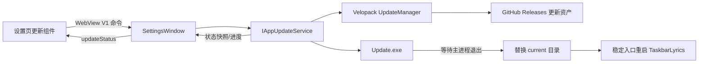

# TaskbarLyrics 应用内更新实施方案

## 文档状态

- 状态：Deferred — Ready for Future Implementation
- 制定日期：2026-08-09
- 当前生产版本基线：`1.6.2`
- 推荐技术路线：Velopack + GitHub Releases
- 当前阶段：仅完成方案设计，尚未接入更新框架或改变发布格式
- 实施原则：先建立可安装、可验证、可回退的更新基础，再开放应用内下载与应用

## 目标结果

完成本方案后，TaskbarLyrics 应提供以下能力：

1. 保留现有每天最多一次的自动检查更新和手动检查入口。
2. 在设置页展示新版本、更新说明、下载大小、下载进度和明确的失败原因。
3. 由用户主动执行“下载更新”和“重启并更新”；第一版不静默下载、不强制更新。
4. 主程序完成正常资源释放后，由独立更新进程替换完整应用目录并重新启动。
5. 同时提供普通用户使用的按用户安装器和继续支持便携用户的自更新 Portable 包。
6. 更新前后保留设置、歌词缓存、歌曲映射、单曲偏移和其他用户数据。
7. 更新包经过框架校验，正式发布的可执行文件、安装器和更新器使用一致的可信发布者签名。
8. 更新失败、取消或文件被占用时保留当前可运行版本，并提供重试或手动下载路径。

## 非目标

第一版不包含：

- 强制更新或阻止旧版本启动。
- 后台服务常驻下载或无提示安装。
- Beta、Nightly 等多更新通道。
- 应用运行期间由主进程直接覆盖自身文件。
- 自研二进制差分算法、自研安装器或自研目录替换协议。
- 自动删除旧 ZIP 解压目录或用户可能放入其中的其他文件。
- 自动回退到任意历史版本的用户界面。
- Microsoft Store 或 MSIX 发布迁移。

## 固定产品与工程决策

1. 使用 Velopack 管理安装、更新包、增量包、校验、替换和重启。
2. 继续使用公开 GitHub Releases 作为稳定更新源。
3. Windows x64 是第一版唯一更新运行时，最低系统要求继续遵循当前 Windows 10/11 基线。
4. 新用户默认推荐 `Setup.exe` 按用户安装；同时发布 `Portable.zip`。
5. 第一版仅自动检查，不自动下载；应用更新必须由用户明确触发。
6. 下载完成后不依赖启动时自动应用，使用显式“重启并更新”。
7. 更新实现属于 `TaskbarLyrics.App`，不得将 Velopack、WPF、GitHub 或 Windows 生命周期依赖引入 `TaskbarLyrics.Core`。
8. 设置页继续使用原生 HTML、CSS、JavaScript 和 WebView V1 信封 `{ version: 1, type, payload }`。
9. `%APPDATA%\TaskbarLyrics` 下的设置、缓存和数据库继续作为安装路径之外的持久数据。
10. 正式开放应用内更新前必须建立代码签名流程；自签名证书不得用于公开发布。

## 方案比较与选择依据

| 方案 | 优点 | 主要成本或风险 | 结论 |
| --- | --- | --- | --- |
| Velopack | WPF/.NET 接入直接；生成安装器、Portable、全量与增量包；负责独立更新进程、目录替换、重启、校验和占用处理 | 安装布局改变；现有普通 ZIP 不是可识别安装，需要一次迁移 | 采用 |
| 自研 ZIP 更新器 | 表面上最接近现有发布格式 | 必须自行实现权限、路径验证、完整性、文件占用、旧文件清理、回滚、更新器自更新和杀软兼容 | 不采用 |
| MSIX + App Installer | Windows 原生安装、更新和修复能力；适合 Store 或企业部署 | 需要包身份和签名；安装路径只读；开机启动、日志路径、便携体验和发布流程均需更大迁移 | 后续独立评估 |
| Microsoft Store | 系统更新体验和 SmartScreen 信任最好 | 需要商店提交、认证、包规范和发布运维 | 后续独立评估 |

## 当前基线

| 责任 | 当前所有者 | 当前行为 | 实施关注点 |
| --- | --- | --- | --- |
| 版本检查 | `TaskbarLyrics.App/UpdateChecker.cs` | 调用 GitHub 最新 Release API，只读取标签和发布页 URL | 替换为可测试的更新服务，同时保留现有状态 DTO 的兼容语义 |
| 自动检查 | `TaskbarLyrics.App/App.xaml.cs` | 启动约 8 秒后检查；每天最多一次；托盘通知 | 保留节流和设置字段，不能把自动检查升级为自动下载 |
| 设置页更新区 | `TaskbarLyrics.App/Web/Settings/*` | 检查更新，发现版本后打开发布页 | 增加下载、取消、进度、待重启和失败恢复状态 |
| 发布 | `scripts/publish-release.ps1` | 自包含、压缩单文件、外部 `Assets`/`Web` 目录和 ZIP | 改为 Velopack 可打包目录，并上传完整更新资产集 |
| 启动入口 | `TaskbarLyrics.App/Program.cs` | DPI 初始化后获取单实例锁，再启动 WPF | Velopack 引导必须成为第一项运行逻辑 |
| 开机启动 | `TaskbarLyrics.App/StartupService.cs` | 将 `Environment.ProcessPath` 写入 HKCU Run | 改为 Velopack 根目录稳定启动器，并在更新后修复旧值 |
| 用户数据 | `%APPDATA%\TaskbarLyrics` | 设置、缓存、数据库位于应用目录外 | 继续保留，无需随安装目录迁移 |
| 运行日志 | 程序目录下 `Logs` | 与可执行文件同目录 | 必须迁移到 `%LocalAppData%\TaskbarLyrics\Logs` 或其他非版本目录 |
| 单实例 | `TaskbarLyrics.App/SingleInstanceService.cs` | LocalAppData 锁文件 + 命名管道 | 更新钩子必须在获取单实例锁之前运行；正常重启仍需释放锁 |

## 目标架构



### 责任边界

#### `IAppUpdateService`

该边界用于隔离第三方框架、网络、文件系统、进程重启和测试替身。建议能力如下，最终签名可在实施时按 Velopack 稳定 API 调整：

```csharp
internal interface IAppUpdateService
{
    AppUpdateSnapshot Current { get; }

    Task<AppUpdateSnapshot> CheckAsync(CancellationToken cancellationToken);

    Task DownloadAsync(
        IProgress<AppUpdateProgress> progress,
        CancellationToken cancellationToken);

    void ApplyAndRestart();
}
```

约束：

- 同一时间只允许一个检查或下载操作。
- 调用者取消下载时返回取消状态，不记录为更新失败。
- `CheckAsync` 不下载包。
- `DownloadAsync` 只接受最近一次仍有效的候选版本，禁止使用过期候选。
- `ApplyAndRestart` 仅在完整包已校验且处于待应用状态时可调用。
- 更新服务记录一次带上下文的错误；窗口和前端不重复记录同一异常。
- 开发环境直接运行 `bin` 时应返回“当前构建不支持应用内更新”，不能让设置页崩溃。

#### `AppCompositionRoot`

- 构造生产更新服务并注入应用和设置窗口。
- 不允许窗口自行创建 `UpdateManager` 或 GitHub 客户端。
- 测试使用可控的更新服务替身，不依赖真实 GitHub 网络。

#### `Program.Main`

Velopack 引导必须位于 DPI、单实例和 WPF 初始化之前：

```csharp
VelopackApp.Build()
    .SetAutoApplyOnStartup(false)
    .Run();
```

Velopack 的安装、更新、卸载快速钩子可能启动同一个 EXE 并要求立即退出，因此任何放在 `Run()` 之前的业务初始化都会在钩子进程中重复执行。

## 更新状态模型

更新状态必须是宿主定义的稳定标识，不使用中文 UI 文案作为协议值。

| 状态 | 含义 | 允许操作 |
| --- | --- | --- |
| `idle` | 尚未检查 | 检查更新 |
| `checking` | 正在读取远程版本 | 取消当前页面等待；不重复检查 |
| `latest` | 当前版本已是最新 | 再次检查 |
| `available` | 存在可下载版本 | 下载更新、打开发布页 |
| `downloading` | 正在下载或重建更新包 | 取消下载 |
| `readyToRestart` | 包已下载并校验 | 重启并更新 |
| `applying` | 已交给更新进程 | 禁止重复操作 |
| `unsupported` | 当前运行副本不是 Velopack 安装或 Portable | 打开迁移说明/发布页 |
| `canceled` | 用户取消下载 | 重新下载 |
| `error` | 网络、校验、磁盘、锁或其他可恢复失败 | 重试、打开发布页 |

状态转换要求：

- `checking`、`downloading` 和 `applying` 必须防止重复提交。
- 新检查结果使旧候选和旧下载进度失效。
- 页面关闭时取消当前页面发起的检查或下载，但不得破坏已完成并校验的待重启包。
- `readyToRestart` 应在重新打开设置页后恢复显示。
- 校验失败不能进入 `readyToRestart`。
- 更新失败不能修改当前安装目录或用户设置。

## 用户交互

### 自动检查

1. 保留 `AutoCheckUpdates` 设置及每天一次的节流。
2. 自动检查只改变更新状态和托盘通知，不自动下载。
3. 同一版本只通知一次，继续复用 `LastNotifiedUpdateVersion`。
4. 网络失败不打断启动，不显示抢焦点对话框。

### 手动更新

```text
检查更新
  → 发现新版本
  → 下载更新
  → 显示下载进度和取消按钮
  → 下载并校验完成
  → 重启并更新
  → 正常释放资源并退出
  → Update.exe 替换版本目录
  → 新版本启动
  → 显示“已更新到 x.x.x”
```

### 设置页展示要求

- 版本号、包大小和错误信息视为不受控长文本，必须允许换行或省略并提供完整 `title`。
- 检查和下载状态使用 `aria-live="polite"`，不得频繁逐字播报进度。
- 下载进度使用原生 `<progress>` 或具有完整可访问名称和值的等价结构。
- Loading 状态禁用重复操作。
- 取消下载不使用危险色；“重启并更新”是主要操作。
- 错误状态必须包含可恢复动作，至少提供“重试”和“打开发布页”。
- 所有操作支持 Tab、Shift+Tab、Enter、Space；焦点在状态重绘后保持或落到合理的后续动作。
- 不新增前端框架、在线 CDN 或新的生产构建流水线。

## WebView V1 协议草案

命令名称可在实施时集中定义，但必须保持 C#、JavaScript、契约测试和行为测试一致。

### Web → Host

| 类型 | Payload | 说明 |
| --- | --- | --- |
| `checkForUpdates` | 无 | 复用现有命令 |
| `downloadUpdate` | 无 | 下载当前有效候选 |
| `cancelUpdateDownload` | 无 | 取消当前下载 |
| `applyUpdate` | 无 | 保存状态、退出并应用已校验更新 |
| `openExternalLink` | 已验证的发布页 URL | 保留手动下载后备路径 |

### Host → Web

继续复用单一 `updateStatus` 消息，建议 payload：

```json
{
  "state": "available",
  "currentVersion": "1.6.2",
  "targetVersion": "1.7.0",
  "releaseNotes": "",
  "downloadSizeBytes": 0,
  "progressPercent": null,
  "message": "发现新版本 1.7.0",
  "releaseUrl": "https://github.com/ANYNC/TaskbarLyrics/releases/tag/v1.7.0",
  "canRetry": false
}
```

边界要求：

- 前端传入的 URL、版本和状态均不可信；最终外部链接只能由宿主允许列表校验后打开。
- 数字必须验证有限性和范围，进度限制在 `0..100`。
- 缺少新增字段时回退到现有“检查更新/打开发布页”体验。
- 未知版本、类型和错误 payload 安全忽略。

## 下载、校验和应用

1. `CheckForUpdatesAsync` 只读取稳定通道发布索引。
2. 下载过程支持 `CancellationToken` 和节流后的进度回调。
3. Velopack 优先选择有效增量；增量不存在、重建失败或总大小不合算时回退全量包。
4. 包的尺寸或校验和不匹配时删除损坏下载并进入可重试错误状态。
5. 主程序不得解压到当前安装目录。
6. 应用更新前完成设置保存和正常关闭流程，再调用显式应用并重启。
7. `Update.exe` 等待主进程退出后替换完整 `current` 目录。
8. 文件被安全软件、WebView2 子进程或其他进程占用时，不强制破坏当前可运行版本；显示更新框架错误并允许稍后重试。

## 应用退出顺序

更新退出必须复用正常应用所有权，而不是新增一套不完整的快速退出路径：

1. 将应用状态切换为“正在应用更新”，阻止重复退出和新后台任务。
2. 保存当前设置和持久状态。
3. 取消更新检查以外的应用后台任务。
4. 停止歌词同步、频谱采集和 WebView 定时器。
5. 关闭设置、频谱调节和诊断窗口。
6. 释放全局快捷键、托盘、WebView2、原生钩子和系统事件订阅。
7. 停止歌词 STA 线程并等待其退出。
8. 释放单实例锁和激活管道。
9. 调用更新框架应用并重启。

禁止在 WPF Dispatcher 上同步等待可能长期阻塞的网络下载。

## 安装布局与持久数据

Velopack Windows 按用户安装的目标布局大致为：

```text
%LocalAppData%\TaskbarLyrics
├─ TaskbarLyrics.exe        稳定启动入口
├─ Update.exe
├─ current\                当前版本，更新时整体替换
│  ├─ TaskbarLyrics.exe
│  ├─ Assets\
│  └─ Web\
└─ packages\               更新包缓存
```

用户数据继续位于：

```text
%APPDATA%\TaskbarLyrics
├─ settings.json
├─ cache\
└─ database\
```

### 日志迁移

当前日志位于程序目录，进入 Velopack 后会随 `current` 目录替换。实施前必须：

- 将新日志路径改为 `%LocalAppData%\TaskbarLyrics\Logs`。
- 不在升级时删除旧解压目录中的日志。
- 故障排查文档和 README 同步更新日志位置。
- 测试显式路径注入继续有效，不依赖真实用户目录。

### 开机启动迁移

当前 HKCU Run 值可能指向旧 ZIP EXE 或 Velopack `current` 内真实 EXE。目标行为：

- 已启用开机启动时写入 Velopack 根目录稳定启动入口。
- 新安装或更新后按现有 `StartWithWindows` 设置幂等修复注册表值。
- 未启用时不得因安装器或更新自动打开该设置。
- 旧 ZIP 路径不再有效后，只替换 TaskbarLyrics 自己的注册表值，不修改其他应用项。

## 发布与版本管理

### 发布资产

每个稳定 Release 至少包含：

- `TaskbarLyrics-Setup.exe`
- `TaskbarLyrics-Portable.zip`
- `TaskbarLyrics-x.x.x-full.nupkg`
- 有前一稳定版本时生成的 `TaskbarLyrics-x.x.x-delta.nupkg`
- `releases.<stable-channel>.json`
- 面向仍处于旧体系用户的手动下载说明

### 发布脚本调整

`scripts/publish-release.ps1` 应拆分为明确阶段：

1. 验证三段式 SemVer 和干净工作区。
2. 运行完整验证及零警告 Release 构建。
3. 发布 `win-x64` 自包含应用目录。
4. 使用仓库固定版本的 `vpk` 打包，禁止依赖开发机任意全局版本。
5. 在 CI 或本地发布目录取得上一稳定版全量包，以便生成增量。
6. 使用 Velopack 在正确阶段签名应用、安装器和更新器。
7. 生成资产清单并验证必须文件、版本、架构和签名。
8. 上传 GitHub Draft Release；人工核验后再发布。

版本号必须只有一个事实来源。实施时应消除“发布参数、项目文件和 Release 标签各自独立”的可能，发布脚本只读取或验证该版本，不在产物生成后隐式修改源文件。

### 单文件发布决策

目标改为“自包含多文件 + Velopack 包压缩”，不继续压缩单文件：

- 大型压缩单文件在小改动后也可能产生大范围二进制变化，降低增量包收益。
- 多文件发布允许未变化的运行库和程序集复用，Velopack 可按文件生成更小的增量。
- 安装器和 Portable 包仍为单一下载资产，用户不直接管理内部文件数量。

在正式冻结前使用连续两个实际 Release 构建测量全量包、增量包、安装时间和冷启动；如结果与预期不符，再记录证据调整，不凭假设微优化。

## 代码签名与供应链安全

### 发布门槛

- 正式更新源中的主 EXE、`Setup.exe` 和 `Update.exe` 使用同一可信发布者身份签名。
- 签名发生在 Velopack 要求的打包阶段，签名后不得再次修改可执行文件。
- GitHub 发布权限启用最小权限、双因素认证和受保护的发布流程。
- 发布工具版本固定并纳入依赖更新审查。
- GitHub Token 只存在于 CI Secret 或进程环境，不写入脚本、日志、命令行示例或更新包。
- 公开发布不使用自签名证书。

### 签名方案待办

正式实施前从以下方案中确定一个：

1. 符合条件时申请 SignPath Foundation 开源项目签名。
2. 使用受信任 CA 颁发的 OV 代码签名证书。
3. 如果未来进入 Microsoft Store，改由 Store 对 MSIX 重新签名。

未确定可信签名方案时，只能进行内部更新原型和测试，不能向普通用户开放自动执行下载产物。

## 旧 ZIP 用户迁移

现有 ZIP 解压目录不包含 Velopack 元数据，不能直接调用 `UpdateManager` 完成第一次自更新。

### 第一版迁移策略

1. 发布一个最后的传统 ZIP 版本和同版本的 Velopack `Setup.exe`、`Portable.zip`。
2. 传统 ZIP 版本继续使用现有“打开发布页”路径，并在 Release 说明中明确这是一次性迁移。
3. 普通用户运行 `Setup.exe`；便携用户将新的 Portable 包解压到新目录。
4. 新程序从现有 `%APPDATA%\TaskbarLyrics` 读取设置、缓存和数据库。
5. 新程序启动时根据 `StartWithWindows` 修复开机启动路径。
6. 旧 ZIP 目录不自动删除；确认新版本正常后由用户自行删除。
7. 此后的 Velopack 版本均使用应用内更新。

### 可选后续增强

如果实际用户反馈表明一次手动迁移不可接受，可单独规划“旧版迁移助手”：

- 只下载并启动已签名的官方 `Setup.exe`。
- 不自行解压或替换旧目录。
- 启动安装器前显示目标版本、发布者和数据保留说明。
- 安装成功后不自动删除旧目录。

迁移助手不是应用内更新第一版的前置条件。

## 错误与恢复策略

| 场景 | 预期行为 |
| --- | --- |
| GitHub 不可达或限流 | 保留当前版本；状态显示网络失败；允许重试和打开发布页 |
| 下载被取消 | 删除或由框架管理未完成文件；返回 `canceled`；不显示为错误 |
| 下载中断 | 下次重试由框架决定续传或重新下载；不得使用未校验文件 |
| 磁盘空间不足 | 保留当前版本；显示需要释放空间；不进入待重启状态 |
| 校验失败 | 删除损坏包；记录安全相关错误；允许从官方源重新下载 |
| 多次点击检查/下载 | 单一操作锁拒绝重入，前端保持当前进行中状态 |
| 应用目录被占用 | 更新器终止应用自身受管进程或提示稍后重试；不能破坏旧版本 |
| 当前副本不是 Velopack 安装 | 返回 `unsupported`，引导一次迁移，不抛出未观察异常 |
| 新版本发布后撤回 | 默认不自动降级；发布更高修复版本，或由维护者单独执行受控回退方案 |
| 更新后应用不能正常启动 | 保留手动下载上一稳定版路径和故障日志；自动健康回滚作为后续独立能力 |

## 实施阶段

### U0 — 打包可行性原型

目标：不改生产更新 UI，先证明现有 WPF、自包含资源和 GitHub 资产能被 Velopack 正确安装和更新。

工作：

- 固定 Velopack NuGet 与 `vpk` 工具版本。
- 在隔离输出目录生成 Setup、Portable、全量包、增量包和发布索引。
- 验证 `Assets`、`Web`、字体、图标和 WebView2 资源完整。
- 用两个测试版本完成安装、增量更新、全量回退和重启。
- 测量单文件与多文件的全量/增量大小后冻结发布模式。

完成条件：

- 全新安装和 Portable 均可运行。
- 测试版本 A 可更新到 B，设置和歌词数据不变。
- 更新失败时版本 A 仍可启动。
- 未上传公开稳定 Release。

### U1 — 启动与持久路径适配

目标：建立更新框架启动边界，消除版本目录内的持久文件。

工作：

- 在 `Program.Main` 最前接入 Velopack 引导。
- 日志迁移到 LocalAppData。
- 开机启动改用稳定入口并增加迁移测试。
- 验证单实例、命名管道和更新重启顺序。
- 增加 Velopack 安装、更新、卸载钩子的最小安全处理。

完成条件：

- 快速钩子不启动 WPF、歌词线程、托盘或音频采集。
- 正常运行只有一个实例。
- 更新后开机启动仍指向有效稳定路径。
- 日志、设置、缓存不在 `current` 中。

### U2 — 更新服务与自动检查迁移

目标：用可测试的服务替换静态 GitHub 标签检查，同时保持现有检查频率和通知行为。

工作：

- 新增更新服务、状态快照、进度和错误映射。
- 将自动检查和手动检查迁移到同一服务。
- 实现操作串行化、取消和待重启恢复。
- 保留手动打开 Release 页后备路径。
- 为开发环境非安装副本返回 `unsupported`。

完成条件：

- 自动检查不下载更新。
- 所有进行中操作可取消或被正常观察。
- 网络、校验、并发锁和非安装环境均有稳定状态。
- 单元测试不访问真实 GitHub。

### U3 — 设置页下载与应用交互

目标：完成用户可见的下载、取消、进度、重启更新和错误恢复。

工作：

- 扩展设置 WebView V1 消息和 DTO。
- 实现更新状态卡片、原生进度组件和操作按钮。
- 宿主验证所有命令和 payload。
- 完成正常关闭、应用和重启编排。
- 增加 Vitest、App 测试和设置契约标记。

完成条件：

- 键盘、焦点、Loading、Error、Cancel 和长文本状态符合 WebView 规范。
- 下载期间关闭设置页不会留下未观察任务。
- 重启更新只在已校验包上可用。
- `settings-contract.tests.ps1` 通过。

### U4 — 签名、发布与迁移试运行

目标：建立可重复的正式发布链路，并用小范围用户验证从旧 ZIP 到新体系。

工作：

- 接入可信代码签名。
- 改造发布脚本，生成并校验完整资产集。
- 建立 GitHub Draft Release 人工批准流程。
- 发布传统 ZIP 与 Velopack 双格式过渡版本。
- 完成 Win10/Win11、安装版/Portable、更新/取消/失败矩阵。
- 更新 README、功能说明和故障排查文档。

完成条件：

- 正式资产签名有效且发布者一致。
- 安装版和 Portable 均从过渡版本更新到下一稳定版。
- 旧用户数据、开机启动和手动卸载说明正确。
- 完整仓库验证和零警告 Release 构建通过。

## 自动化测试范围

### 更新策略与服务

- 无更新、发现更新、远端版本低于当前版本。
- 稳定通道不接收预发布版本。
- 自动检查节流和同版本通知去重。
- 检查、下载重复调用被串行化或明确拒绝。
- 取消检查、取消下载和页面关闭取消。
- 下载进度限制在 `0..100`，旧候选进度不会覆盖新候选。
- 网络失败、JSON/索引错误、校验失败、磁盘错误和更新锁冲突。
- 非 Velopack 安装返回 `unsupported`。
- 已下载更新在设置页重新打开后恢复 `readyToRestart`。

### 启动与持久化

- Velopack 快速钩子先于单实例和 WPF 初始化。
- 开机启动启用、禁用、旧 ZIP 路径和稳定启动器修复。
- 日志路径位于版本目录之外。
- 设置、缓存和数据库路径不随安装路径变化。
- 更新退出释放单实例锁、托盘、快捷键、频谱和歌词窗口线程。

### WebView 协议与行为

- V1 检查、下载、取消和应用命令。
- 未知版本、未知类型、缺失或错误 payload 安全忽略。
- `idle` 到 `readyToRestart` 的全部可见状态。
- 下载按钮防重入、取消恢复和错误重试。
- `aria-live`、键盘操作、焦点保持和 `<progress>` 值。
- 长版本号、长错误信息和窄窗口布局。

### 发布脚本

- 非法版本、重复版本、脏工作区和缺少签名配置时失败。
- 产物不包含测试项目、`node_modules`、日志、缓存或 `build_verify*`。
- Setup、Portable、full、delta 和发布索引的版本/架构一致。
- 没有上一版本时允许只生成 full；存在上一版本时验证 delta。
- 发布后源文件版本不会被脚本意外修改。

## Windows 手工验收矩阵

| 维度 | 场景 |
| --- | --- |
| 系统 | Windows 10 x64、Windows 11 x64 |
| 形式 | 全新 Setup、全新 Portable、旧 ZIP 数据迁移 |
| 更新 | 无更新、全量更新、增量更新、跨多个版本更新 |
| 网络 | 正常、断网、下载中断、GitHub 限流或代理失败 |
| 存储 | 磁盘空间不足、只读目录、Portable 位于无写权限目录 |
| 占用 | 设置窗口、歌词 WebView、频谱调节窗口开启时更新 |
| 生命周期 | 托盘常驻、开机启动、更新重启、系统注销/关机竞态 |
| 安全 | 签名检查、篡改包校验失败、Defender/常见安全软件扫描 |
| 数据 | 设置、歌词缓存、数据库、单曲偏移和日志保留 |
| UI | 深浅主题、高对比度、100%/125%/150%/200% DPI、720px 以下设置窗口 |

## 每阶段验证要求

每个可独立交付阶段均必须：

1. 先运行直接受影响的 Targeted 验证。
2. 完成功能后运行相应 Project 验证。
3. 设置 HTML/JS/CSS/C# 变化时运行设置契约测试。
4. 阶段交付前运行 `scripts/verify.ps1`。
5. 运行 `dotnet build TaskbarLyrics.sln`，要求 0 警告、0 错误。
6. 运行 `git diff --check`。
7. 完成发布包或安装生命周期变更时进行真实 Setup/Portable A→B 手工升级。
8. 更新 `docs/工程变更记录.md`，只记录已完成并验证的阶段。
9. 影响可运行应用的阶段通过验证后运行 `scripts/restart-app.ps1`。

## 回滚边界

- U0 原型只写隔离构建目录和发布脚本草案，不改变生产更新入口。
- U1 可通过移除 Velopack 引导并恢复原路径策略回滚，不迁移或删除用户数据。
- U2 在设置页下载功能开放前保留现有 Release 页检查作为后备。
- U3 如应用更新不稳定，可隐藏下载/应用动作并继续使用手动发布页，不回滚数据格式。
- U4 发布异常时撤回 Release 资产并发布更高修复版本；默认不启用客户端自动降级。
- 任何回滚都不得删除 `%APPDATA%\TaskbarLyrics` 或旧 ZIP 目录。

## 上线前仍需确认

1. 代码签名提供者和发布者显示名称，在 U4 开始前确定。
2. Velopack `packId`、稳定通道名和 GitHub 资产命名，在 U0 开始前确定。
3. 过渡版本号和停止发布传统 ZIP 的版本节点，在 U4 开始前确定。
4. Release Notes 使用 GitHub Markdown 的允许子集和展示长度，在 U3 开始前确定。

上述决策必须在对应阶段开始前记录，不应由实现代码隐式决定。Setup 作为普通用户主入口、Portable 作为便携入口以及日志迁移到 LocalAppData 已在本文固定，不再作为实施时的临时选择。

## 最终交付定义

只有满足以下条件，才可声明应用内更新完成：

- Setup 和 Portable 都能从公开稳定源检查、下载、校验、应用并重启。
- 旧 ZIP 用户有经过验证的一次迁移路径。
- 用户设置、缓存、数据库、开机启动和日志行为符合文档。
- 正式发布资产具有一致的可信代码签名。
- 更新失败不会破坏当前版本，且用户能重试或手动下载。
- 设置 WebView 的状态、取消、键盘、错误恢复和 V1 协议测试通过。
- 完整仓库验证、零警告解决方案构建、发布资产检查和 Windows 手工升级矩阵通过。
- README、功能说明、故障排查和工程变更记录与实际行为一致。

## 参考资料

- [Velopack：WPF 入门](https://docs.velopack.io/getting-started/wpf)
- [Velopack：集成与更新机制](https://docs.velopack.io/integrating/overview)
- [Velopack：Windows 安装和更新布局](https://docs.velopack.io/packaging/operating-systems/windows)
- [Velopack：发布资产与 Portable 包](https://docs.velopack.io/packaging/overview)
- [Velopack：增量更新](https://docs.velopack.io/packaging/deltas)
- [Velopack：持久文件和设置](https://docs.velopack.io/integrating/preserved-files)
- [Velopack：代码签名](https://docs.velopack.io/packaging/signing)
- [Microsoft：MSIX App Installer 自动更新和修复](https://learn.microsoft.com/windows/msix/app-installer/auto-update-and-repair--overview)
- [Microsoft：Windows 应用代码签名选项](https://learn.microsoft.com/windows/apps/package-and-deploy/code-signing-options)
