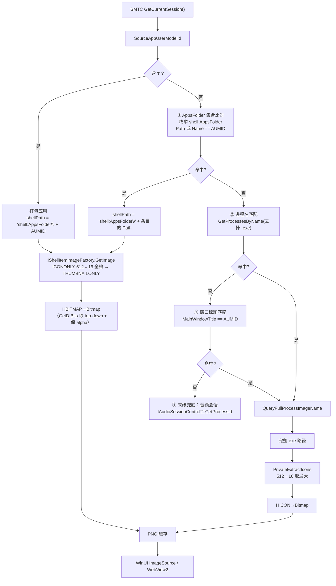

# TaskbarLyrics — 图标提取方案

> **项目**：https://github.com/ANYNC/TaskbarLyrics  
> **技术栈**：.NET 8 + WebView2  
> **目标**：从 SMTC 会话反查进程名 / AUMID → 完整路径 → 提取高分辨率应用图标

## 背景：Windows SMTC 会话信息示例

同一套 SMTC API，不同应用吐出来的字段差异很大。下面是两份真实抓取。

### 示例 A：QQMusic —— `SourceAppUserModelId` 是**进程名**

``` SMTC full info
Local time : 2026-09-29 21:50:21 +08:00

GlobalSystemMediaTransportControlsSessionManager
GetSessions().Count  : 1
GetCurrentSession()  : QQMusic.exe

======================= SESSION #1 =======================
SourceAppUserModelId : QQMusic.exe

GetPlaybackInfo()
  PlaybackStatus            : Paused
  PlaybackType              : Music
  PlaybackRate              : (null)
  AutoRepeatMode            : (null)
  IsShuffleActive           : (null)
  Controls:
    IsPlayEnabled             : True
    IsPauseEnabled            : False
    IsPlayPauseToggleEnabled  : True
    IsNextEnabled             : True
    IsPreviousEnabled         : True
    IsStopEnabled             : False
    IsFastForwardEnabled      : False
    IsRewindEnabled           : False
    IsRecordEnabled           : False
    IsRepeatEnabled           : False
    IsShuffleEnabled          : False
    IsPlaybackRateEnabled     : False
    IsPlaybackPositionEnabled : False
    IsChannelUpEnabled        : False
    IsChannelDownEnabled      : False

GetTimelineProperties()
  StartTime                 : 00:00:00.000
  EndTime                   : 00:04:19.133  (259133 ms)
  Position                  : 00:04:19.088  (259088 ms)
  MinSeekTime               : 00:00:00.000
  MaxSeekTime               : 00:00:00.000
  LastUpdatedTime           : 2026-09-29 21:16:04 +08:00

TryGetMediaPropertiesAsync()
  Title                     : 富士山下
  Artist                    : 陈奕迅
  AlbumTitle                : What's Going On...?
  AlbumArtist               : (empty)
  Subtitle                  : (empty)
  Genres                    : []
  TrackNumber               : 0
  AlbumTrackCount           : 0
  PlaybackType              : Music
  Thumbnail                 : Windows.Storage.Streams.RandomAccessStreamReference

Session
  SourceAppUserModelId      : QQMusic.exe
```

### 示例 B：汽水音乐（SodaMusic）—— `SourceAppUserModelId` 是**显示名**

``` SMTC full info
Local time : 2026-09-29 23:12:22 +08:00

GlobalSystemMediaTransportControlsSessionManager
GetSessions().Count  : 1
GetCurrentSession()  : 汽水音乐

======================= SESSION #1 =======================
SourceAppUserModelId : 汽水音乐

GetPlaybackInfo()
  PlaybackStatus            : Playing
  PlaybackType              : Music
  PlaybackRate              : 1
  AutoRepeatMode            : (null)
  IsShuffleActive           : (null)
  Controls:
    IsPlayEnabled             : False
    IsPauseEnabled            : True
    IsPlayPauseToggleEnabled  : True
    IsNextEnabled             : True
    IsPreviousEnabled         : True
    IsStopEnabled             : True
    IsFastForwardEnabled      : False
    IsRewindEnabled           : False
    IsRecordEnabled           : False
    IsRepeatEnabled           : False
    IsShuffleEnabled          : False
    IsPlaybackRateEnabled     : False
    IsPlaybackPositionEnabled : True
    IsChannelUpEnabled        : False
    IsChannelDownEnabled      : False

GetTimelineProperties()
  StartTime                 : 00:00:00.000
  EndTime                   : 00:00:29.001  (29001 ms)
  Position                  : 00:00:00.010  (10 ms)
  MinSeekTime               : 00:00:00.000
  MaxSeekTime               : 00:00:29.001
  LastUpdatedTime           : 2026-09-29 23:12:00 +08:00

TryGetMediaPropertiesAsync()
  Title                     : 又三郎
  Artist                    : ヨルシカ
  AlbumTitle                : (null)
  AlbumArtist               : (null)
  Subtitle                  : (null)
  Genres                    : []
  TrackNumber               : 0
  AlbumTrackCount           : 0
  PlaybackType              : Music
  Thumbnail                 : Windows.Storage.Streams.RandomAccessStreamReference

Session
  SourceAppUserModelId      : 汽水音乐
```

### 两份样本的差异

| 字段 | 示例 A：QQMusic | 示例 B：汽水音乐 | 对实现的影响 |
|---|---|---|---|
| `SourceAppUserModelId` | `QQMusic.exe`（进程名） | `汽水音乐`（显示名） | **决定反查策略**，见下文 |
| `PlaybackStatus` | `Paused` | `Playing` | — |
| `PlaybackRate` | `(null)` | `1` | 不要假设一定有倍速信息 |
| `AlbumTitle` / `AlbumArtist` | 有值 / `(empty)` | `(null)` / `(null)` | 元数据稀疏度因应用而异 |
| `Subtitle` | `(empty)` | `(null)` | 同上 |
| `Genres` / `TrackNumber` / `AlbumTrackCount` | 空 / `0` / `0` | 空 / `0` / `0` | 多数应用根本不填 |
| `MaxSeekTime` | `00:00:00.000` | `00:00:29.001` | 判断该曲目能否 seek |
| `IsPlaybackPositionEnabled` | `False` | `True` | 是否该画进度条 |

**要点**：字段缺失是常态。不要假设 `AlbumTitle` / `TrackNumber` / `Genres` 一定有值，
歌词匹配至少要能退化成 `Title + Artist`；进度条应依据 `IsPlaybackPositionEnabled`
与 `MaxSeekTime > 0` 判断。

---

## 0. 结论先行

### 各取图 API 的取图尺寸

| 场景 | 策略 | 结果 |
|---|---|---|
| 桌面 exe | `PrivateExtractIcons` 从 512 逐档降 | ✅ **512×512** |
| 桌面 exe | `IShellItemImageFactory` (`SIIGBF_ICONONLY`) | ✅ 512×512 |
| 桌面 exe | `ExtractIconEx` | ⚠️ 只有 32×32 |
| 桌面 exe | `SHGetFileInfo(SHGFI_LARGEICON)` | ⚠️ 只有 32×32 |
| UWP | `SHCreateItemFromParsingName("shell:AppsFolder\\{AUMID}")` + `IShellItemImageFactory` | ✅ **512×512（带 alpha）** |
| UWP | `ILCreateFromPath` + `SHGetFileInfo(SHGFI_PIDL)` | ⚠️ 只有 32×32（仅作兜底） |

**结论**：桌面用 `PrivateExtractIcons`，UWP 用 `IShellItemImageFactory`；`ExtractIconEx`/`SHGetFileInfo` 只能当保底。

### `SourceAppUserModelId` 的形态全景（关键）

**它不是稳定的标识符，而是开发者任意指定的字符串**，没有任何格式约束。
实测本机 `shell:AppsFolder` 共 226 个条目，非打包形态就已有这么多花样：

| 形态 | 实测例子 | 能否直接反查 |
|---|---|---|
| 进程名 | `QQMusic.exe` | ✅ 进程名匹配 |
| 打包 AUMID | `Microsoft.WindowsCalculator_8wekyb3d8bbwe!App` | ✅ 含 `!`，走 `shell:AppsFolder\{AUMID}` |
| **反向域名式** | `com.soda.music`、`com.coolapk.market`、`com.nvidia.nvapp`、`com.amazon.venezia`、`com.topjohnwu.magisk`、`io.github.clash-verge-rev.clash-verge-rev`、`me.nabdev.iloader` | ✅ AppsFolder 条目 `Path` 比对 |
| 产品名式 | `Microsoft.VisualStudioCode`、`MSEdge`、`QQ`、`QuarkCloudDrive`、`BiliBiliPC`、`Snap.Hutao.Remastered` | ✅ AppsFolder 条目 `Path` 比对 |
| 版本后缀式 | `Microsoft.Office.EXCEL.EXE.15` | ✅ 同上 |
| GUID 式 | `Microsoft.AutoGenerated.{04770C2D-34E6-BE94-EFAD-FA817237D6E9}` | ✅ 同上 |
| 窗口类名 | `CNEventWindowClass` | ⚠️ 需窗口标题 / 进程名兜底 |
| URL | `https://pixpin.cn`、`http://support.steampowered.com/` | ⚠️ 通常无图标，退默认图 |
| 纯路径 | `C:\...\QQMusic_19.51\QQMusic.exe`、`{GUID}\cmd.exe` | ✅ 本身即路径 |
| **显示名** | `汽水音乐` | ✅ AppsFolder 条目 `Name` 比对 |

#### 为什么不靠「关键字匹配」

面对 `com.xxx.yyy` 这种形态，直觉做法是取末段当关键字去模糊匹配进程名。**实测不推荐**：

构造一个进程调用 `SetCurrentProcessExplicitAppUserModelID("com.example.fake.musicplayer")`
（返回 `hr=0x00000000`，成功），三种策略同时扫描：

| 策略 | 结果 |
|---|---|
| 按 AUMID 精确匹配（`GetApplicationUserModelId` 扫全进程） | `matched = 0` |
| 当进程名匹配（`GetProcessesByName("com.example.fake.musicplayer")`） | `0` 个 |
| 关键字匹配（取末段 `musicplayer` 做 `Contains`） | **0 命中** |

三个硬伤：

1. **推不出关键字** —— 反向域名末段与进程名之间没有必然关系；
2. **桥不了显示名** —— `汽水音乐` ↔ `com.soda.music` 之间**没有任何公共子串**，关键字匹配在此彻底无解；
3. **误伤严重** —— `music` / `qq` / `edge` 这类短关键字会命中一堆无关进程。

#### 正确做法：把 AUMID 当**闭合集合**查

关键实测发现：

```
shell:AppsFolder 条目      Name = [汽水音乐]        Path = [com.soda.music]
SMTC 报出的 AUMID          =  [汽水音乐]        ← 恰好等于条目的 Name
```

即：**枚举 `shell:AppsFolder`，用 AUMID 比对条目的 `Path`（注册 AUMID）或 `Name`（显示名），
命中后拿条目的 `Path` 构造 `shell:AppsFolder\{Path}` 去提图。**

这一步同时解决反向域名式与显示名式两种形态，而且**不要求应用正在运行、也不要求它有窗口**。
实测三组输入全部命中并得到 512×512 图标：

| 输入 | 解析出的注册 AUMID | 提图结果 |
|---|---|---|
| `汽水音乐`（显示名） | `com.soda.music` | ✅ 512×512 |
| `com.soda.music`（反向域名） | `com.soda.music` | ✅ 512×512 |
| `Microsoft.VisualStudioCode`（产品名） | `Microsoft.VisualStudioCode` | ✅ 512×512 |

> 汽水音乐完整排查过程：
> `shell:AppsFolder\汽水音乐` 直查 → `SHCreateItemFromParsingName` 返回 `hr=0x80070002`（找不到）；
> `GetApplicationUserModelId` 扫全进程 → 0 命中；进程名匹配 → 不命中；
> **窗口标题匹配命中**（其窗口标题就是 `汽水音乐`）；**AppsFolder 的 `Name` 比对同样命中**，
> 且后者更通用。反查到的 exe 路径为 `%LOCALAPPDATA%\Programs\Soda Music\3.7.0\SodaMusic.exe`。

## 1. 数据流



## 2. 实现代码（可直接复制）

模块共 4 个文件，职责单一，除 `Native` 作为 P/Invoke 汇总外互不依赖：

| 文件 | 职责 |
|---|---|
| `Native.cs` | 全部 P/Invoke / COM 声明 |
| `IconExtractor.cs` | `HBITMAP` / `HICON` → PNG；桌面 exe 与 UWP 两条提图路径 |
| `AppsFolderResolver.cs` | `shell:AppsFolder` 集合比对（**主干反查策略**） |
| `ProcessResolver.cs` | 进程名 / 窗口标题 → 完整 exe 路径 |

### 2.1 `Native.cs` —— P/Invoke 与 COM 声明

```csharp
using System.Runtime.InteropServices;
using System.Text;

internal static class Native
{
    // ---------- 进程 → 完整映像路径 ----------
    public const uint PROCESS_QUERY_LIMITED_INFORMATION = 0x1000;

    [DllImport("kernel32.dll", SetLastError = true)]
    public static extern IntPtr OpenProcess(uint dwDesiredAccess, bool bInheritHandle, int dwProcessId);

    [DllImport("kernel32.dll", SetLastError = true)]
    public static extern bool CloseHandle(IntPtr hObject);

    [DllImport("kernel32.dll", CharSet = CharSet.Unicode, SetLastError = true)]
    public static extern bool QueryFullProcessImageName(IntPtr hProcess, uint dwFlags,
        StringBuilder lpExeName, ref int lpdwSize);

    // ---------- 传统 exe 图标 ----------
    [DllImport("user32.dll", CharSet = CharSet.Unicode, SetLastError = true)]
    public static extern uint PrivateExtractIcons(string szFileName, int nIconIndex, int cxIcon, int cyIcon,
        IntPtr[] phicon, uint[]? piconid, uint nIcons, uint flags);

    [DllImport("shell32.dll", CharSet = CharSet.Unicode)]
    public static extern uint ExtractIconEx(string lpszFile, int nIconIndex,
        IntPtr[]? phiconLarge, IntPtr[]? phiconSmall, uint nIcons);

    [DllImport("user32.dll", SetLastError = true)]
    public static extern bool DestroyIcon(IntPtr hIcon);

    // ---------- SHGetFileInfo（兜底） ----------
    public const uint SHGFI_ICON      = 0x000000100;
    public const uint SHGFI_LARGEICON = 0x000000000;
    public const uint SHGFI_PIDL      = 0x000000008;

    [StructLayout(LayoutKind.Sequential, CharSet = CharSet.Unicode)]
    public struct SHFILEINFO
    {
        public IntPtr hIcon;
        public int iIcon;
        public uint dwAttributes;
        [MarshalAs(UnmanagedType.ByValTStr, SizeConst = 260)] public string szDisplayName;
        [MarshalAs(UnmanagedType.ByValTStr, SizeConst = 80)]  public string szTypeName;
    }

    [DllImport("shell32.dll", CharSet = CharSet.Unicode)]
    public static extern IntPtr SHGetFileInfo(string pszPath, uint dwFileAttributes,
        ref SHFILEINFO psfi, uint cbFileInfo, uint uFlags);

    [DllImport("shell32.dll", CharSet = CharSet.Unicode)]
    public static extern IntPtr SHGetFileInfo(IntPtr pidl, uint dwFileAttributes,
        ref SHFILEINFO psfi, uint cbFileInfo, uint uFlags);

    [DllImport("shell32.dll", CharSet = CharSet.Unicode)]
    public static extern IntPtr ILCreateFromPath(string pszPath);

    [DllImport("shell32.dll")]
    public static extern void ILFree(IntPtr pidl);

    // ---------- IShellItemImageFactory：exe 路径 & shell:AppsFolder\{AUMID} 通吃 ----------
    public const int SIIGBF_BIGGERSIZEOK  = 0x01;
    public const int SIIGBF_ICONONLY      = 0x04;   // ← UWP 图标首选
    public const int SIIGBF_THUMBNAILONLY = 0x08;   // ← 次选

    [StructLayout(LayoutKind.Sequential)]
    public struct SIZE { public int cx, cy; public SIZE(int c) { cx = c; cy = c; } }

    [ComImport, Guid("bcc18b79-ba16-442f-80c4-8a59c30c463b"),
     InterfaceType(ComInterfaceType.InterfaceIsIUnknown)]
    public interface IShellItemImageFactory
    {
        [PreserveSig]
        int GetImage([In, MarshalAs(UnmanagedType.Struct)] SIZE size, [In] int flags,
                     [Out] out IntPtr phbm);
    }

    [DllImport("shell32.dll", CharSet = CharSet.Unicode, PreserveSig = true)]
    public static extern int SHCreateItemFromParsingName(string pszPath, IntPtr pbc,
        [MarshalAs(UnmanagedType.LPStruct)] Guid riid,
        [Out, MarshalAs(UnmanagedType.Interface)] out IShellItemImageFactory ppv);

    // ---------- HBITMAP → Bitmap ----------
    [StructLayout(LayoutKind.Sequential)]
    public struct BITMAP
    {
        public int bmType, bmWidth, bmHeight, bmWidthBytes;
        public ushort bmPlanes, bmBitsPixel;
        public IntPtr bmBits;
    }

    [DllImport("gdi32.dll", SetLastError = true)]
    public static extern int GetObject(IntPtr hgdiobj, int cbBuffer, out BITMAP lpvObject);

    [DllImport("gdi32.dll")]
    public static extern bool DeleteObject(IntPtr hObject);

    // ---------- GetDIBits：显式取 top-down 缓冲，避免猜测 DIB 行序 ----------
    [StructLayout(LayoutKind.Sequential)]
    public struct BITMAPINFOHEADER
    {
        public uint biSize;  public int biWidth, biHeight;
        public ushort biPlanes, biBitCount;
        public uint biCompression, biSizeImage;
        public int biXPelsPerMeter, biYPelsPerMeter;
        public uint biClrUsed, biClrImportant;
    }

    [DllImport("gdi32.dll", SetLastError = true)]
    public static extern int GetDIBits(IntPtr hdc, IntPtr hbm, uint start, uint lines,
        byte[]? bits, ref BITMAPINFOHEADER bmi, uint usage);

    [DllImport("user32.dll")] public static extern IntPtr GetDC(IntPtr hWnd);
    [DllImport("user32.dll")] public static extern int ReleaseDC(IntPtr hWnd, IntPtr hDC);
}
```

### 2.2 `IconExtractor.cs` —— 图标提取核心

```csharp
using System.Drawing;
using System.Drawing.Imaging;
using System.Runtime.InteropServices;

internal static class IconExtractor
{
    private static readonly int[] Sizes = { 512, 256, 192, 128, 96, 72, 64, 48, 32, 24, 16 };

    /// <summary>
    /// HBITMAP(DIB) → Bitmap。Shell 两种来源的行序约定相反：ICONONLY 为 bottom-up、THUMBNAILONLY 为
    /// top-down，而 GetObject 的 bmHeight 两者都为正数、无法判断，所以用 GetDIBits 显式请求 top-down
    /// 缓冲，由 GDI 完成行序转换，同时保留 32bpp 的 alpha。
    /// </summary>
    public static Bitmap? BitmapFromHBitmap(IntPtr hBitmap)
    {
        if (hBitmap == IntPtr.Zero) return null;
        if (Native.GetObject(hBitmap, Marshal.SizeOf<Native.BITMAP>(), out var bm) == 0) return null;
        if (bm.bmBits == IntPtr.Zero || bm.bmBitsPixel != 32) return Bitmap.FromHbitmap(hBitmap);  // 无 alpha 场景

        IntPtr hdc = Native.GetDC(IntPtr.Zero);
        if (hdc == IntPtr.Zero) return Bitmap.FromHbitmap(hBitmap);
        try
        {
            var bmi = new Native.BITMAPINFOHEADER { biSize = (uint)Marshal.SizeOf<Native.BITMAPINFOHEADER>() };
            if (Native.GetDIBits(hdc, hBitmap, 0, 0, null, ref bmi, 0) == 0) return Bitmap.FromHbitmap(hBitmap);

            int w = bmi.biWidth, h = Math.Abs(bmi.biHeight);
            bmi.biPlanes = 1;
            bmi.biBitCount = 32;
            bmi.biCompression = 0;
            bmi.biHeight = -h;                       // 负高度 = 请求 top-down 行序
            bmi.biSizeImage = (uint)(w * h * 4);

            var raw = new byte[w * h * 4];
            if (Native.GetDIBits(hdc, hBitmap, 0, (uint)h, raw, ref bmi, 0) == 0) return Bitmap.FromHbitmap(hBitmap);

            var bmp = new Bitmap(w, h, PixelFormat.Format32bppArgb);
            var bd = bmp.LockBits(new Rectangle(0, 0, w, h), ImageLockMode.WriteOnly, PixelFormat.Format32bppArgb);
            Marshal.Copy(raw, 0, bd.Scan0, raw.Length);
            bmp.UnlockBits(bd);
            return bmp;
        }
        finally { Native.ReleaseDC(IntPtr.Zero, hdc); }
    }

    /// <summary>① 桌面 exe：PrivateExtractIcons 从 512 逐档降，取能拿到的最大图标。</summary>
    public static bool ExtractFromExe(string exePath, string savePath, int iconIndex = 0)
    {
        foreach (int s in Sizes)
        {
            var h = new IntPtr[1];
            uint n = Native.PrivateExtractIcons(exePath, iconIndex, s, s, h, null, 1, 0);
            if (n is 0 or 0xFFFFFFFF || h[0] == IntPtr.Zero) continue;
            try
            {
                using var ico = Icon.FromHandle(h[0]);   // 512 也能正确保留 alpha（实测）
                using var bmp = ico.ToBitmap();
                bmp.Save(savePath, ImageFormat.Png);
                return true;
            }
            finally { Native.DestroyIcon(h[0]); }
        }
        return false;
    }

    /// <summary>
    /// ② UWP/打包应用：AUMID → shell:AppsFolder\{AUMID} → IShellItemImageFactory。
    ///    参考 EricGameLauncher 的 ExtractStoreAppIcon：先 ICONONLY，再 THUMBNAILONLY。
    /// </summary>
    public static bool ExtractFromStoreApp(string aumid, string savePath)
    {
        string shellPath = aumid.StartsWith("shell:AppsFolder\\", StringComparison.OrdinalIgnoreCase)
            ? aumid
            : "shell:AppsFolder\\" + aumid;

        // 主策略：IShellItemImageFactory
        Guid iid = new("bcc18b79-ba16-442f-80c4-8a59c30c463b");
        if (Native.SHCreateItemFromParsingName(shellPath, IntPtr.Zero, iid, out var factory) == 0
            && factory is not null)
        {
            // flag 在外层：先把图标资源在所有尺寸上试完，只有它整体不可用才退到缩略图。
            // 两者行序约定相反，这样降级只由画质驱动，不会因为某个尺寸体积超限就换到另一套行序。
            foreach (int flag in new[] { Native.SIIGBF_ICONONLY, Native.SIIGBF_THUMBNAILONLY })
                foreach (int sz in Sizes)
                {
                    if (factory.GetImage(new Native.SIZE(sz), flag, out IntPtr hbm) != 0 || hbm == IntPtr.Zero)
                        continue;
                    try
                    {
                        using var bmp = BitmapFromHBitmap(hbm);
                        if (bmp is null) continue;
                        bmp.Save(savePath, ImageFormat.Png);
                        return true;
                    }
                    finally { Native.DeleteObject(hbm); }
                }
        }

        // 兜底：ILCreateFromPath + SHGetFileInfo(SHGFI_PIDL)（只有 32×32）
        IntPtr pidl = Native.ILCreateFromPath(shellPath);
        if (pidl == IntPtr.Zero) return false;
        try
        {
            var shfi = new Native.SHFILEINFO();
            Native.SHGetFileInfo(pidl, 0, ref shfi, (uint)Marshal.SizeOf(shfi),
                Native.SHGFI_ICON | Native.SHGFI_LARGEICON | Native.SHGFI_PIDL);
            if (shfi.hIcon == IntPtr.Zero) return false;
            try
            {
                using var ico = Icon.FromHandle(shfi.hIcon);
                using var bmp = ico.ToBitmap();
                bmp.Save(savePath, ImageFormat.Png);
                return true;
            }
            finally { Native.DestroyIcon(shfi.hIcon); }
        }
        finally { Native.ILFree(pidl); }
    }
}
```

### 2.3 `ProcessResolver.cs` —— AUMID / 进程名 → 完整路径

```csharp
using System.Diagnostics;
using System.Text;

internal static class ProcessResolver
{
    /// <summary>
    /// 反查顺序：① 进程名匹配 → ② 窗口标题匹配。
    /// SMTC 的 SourceAppUserModelId 可能是进程名（QQMusic.exe），也可能是显示名（汽水音乐）。
    /// </summary>
    public static string? ResolveExePath(string aumidOrProcessName)
    {
        if (string.IsNullOrWhiteSpace(aumidOrProcessName)) return null;

        return ResolveByProcessName(aumidOrProcessName)
            ?? ResolveByWindowTitle(aumidOrProcessName);
    }

    /// <summary>① 进程名匹配：AUMID 形如 "QQMusic.exe" 时走这条。</summary>
    private static string? ResolveByProcessName(string aumidOrProcessName)
    {
        string name = aumidOrProcessName.Trim();
        if (name.EndsWith(".exe", StringComparison.OrdinalIgnoreCase)) name = name[..^4];
        if (name.Length == 0) return null;

        foreach (var p in Process.GetProcessesByName(name))          // 精确
        {
            string? path = TryGetPath(p);
            if (path is not null) return path;
        }

        foreach (var p in Process.GetProcesses())                    // 模糊（AUMID 与进程名不完全一致时）
        {
            string pn;
            try { pn = p.ProcessName; } catch { continue; }
            if (pn.Contains(name, StringComparison.OrdinalIgnoreCase) ||
                name.Contains(pn, StringComparison.OrdinalIgnoreCase))
            {
                string? path = TryGetPath(p);
                if (path is not null) return path;
            }
        }
        return null;
    }

    /// <summary>
    /// ② 窗口标题匹配：AUMID 形如显示名（"汽水音乐"）时唯一有效的路径。
    /// SMTC 对未注册 AUMID 的桌面应用会返回其窗口标题，因此拿 MainWindowTitle 比对即可反查进程。
    /// 注意：仅对拥有顶层窗口的应用有效；纯后台无窗口进程需退化到音频会话反查。
    /// </summary>
    private static string? ResolveByWindowTitle(string title)
    {
        string want = title.Trim();
        if (want.Length == 0) return null;

        foreach (var p in Process.GetProcesses())
        {
            string t;
            try
            {
                t = p.MainWindowTitle;
                if (string.IsNullOrEmpty(t)) continue;
            }
            catch { continue; }

            if (!t.Equals(want, StringComparison.OrdinalIgnoreCase) &&
                !t.Contains(want, StringComparison.OrdinalIgnoreCase) &&
                !want.Contains(t, StringComparison.OrdinalIgnoreCase))
                continue;

            string? path = TryGetPath(p);
            if (path is not null) return path;
        }
        return null;
    }

    /// <summary>优先 QueryFullProcessImageName（比 Process.MainModule 更稳，不受架构/权限位宽限制）。</summary>
    private static string? TryGetPath(Process p)
    {
        try
        {
            IntPtr h = Native.OpenProcess(Native.PROCESS_QUERY_LIMITED_INFORMATION, false, p.Id);
            if (h != IntPtr.Zero)
            {
                try
                {
                    var sb = new StringBuilder(1024);
                    int len = sb.Capacity;
                    if (Native.QueryFullProcessImageName(h, 0, sb, ref len) && len > 0)
                        return sb.ToString(0, len);
                }
                finally { Native.CloseHandle(h); }
            }
        }
        catch { /* ignore */ }

        try { return p.MainModule?.FileName; } catch { return null; }
    }
}
```

### 2.4 `AppsFolderResolver.cs` —— AUMID ↔ 注册 AUMID 双向解析（主干策略）

把 `shell:AppsFolder` 当成一个"闭合集合"来查：拿 SMTC 给的 AUMID 去比对条目的
`Path`（注册 AUMID）或 `Name`（显示名），命中后返回条目的 `Path`。

这一条同时覆盖**反向域名式**（`com.soda.music`）与**显示名式**（`汽水音乐`），
且不要求应用正在运行、也不要求它有窗口 —— 因此优先级放在进程反查之前。

```csharp
using System.Collections;
using System.Runtime.InteropServices;

internal static class AppsFolderResolver
{
    private static readonly object Gate = new();
    private static List<(string Name, string Aumid)>? _cache;

    /// <summary>
    /// 在 shell:AppsFolder 里按「注册 AUMID」或「显示名」查条目，返回真实 AUMID。
    /// 一次调用即可覆盖反向域名式（com.soda.music）与显示名式（汽水音乐）两种形态。
    /// </summary>
    public static string? ResolveAumid(string aumidOrDisplayName, bool refresh = false)
    {
        foreach (var (name, id) in Enumerate(refresh))
        {
            if (string.Equals(id, aumidOrDisplayName, StringComparison.OrdinalIgnoreCase) ||
                string.Equals(name, aumidOrDisplayName, StringComparison.OrdinalIgnoreCase))
                return id;
        }
        return null;
    }

    /// <summary>枚举 shell:AppsFolder 全部条目（Name = 显示名，Aumid = 注册 AUMID），结果带缓存。</summary>
    public static IReadOnlyList<(string Name, string Aumid)> Enumerate(bool refresh = false)
    {
        lock (Gate)
        {
            if (_cache is not null && !refresh) return _cache;

            var list = new List<(string, string)>();
            Type? shellType = Type.GetTypeFromProgID("Shell.Application");
            if (shellType is null) return _cache = list;

            dynamic shell = Activator.CreateInstance(shellType)!;
            try
            {
                dynamic? ns = shell.NameSpace("shell:AppsFolder");   // 得到的是 Folder 对象
                if (ns is not null)
                {
                    object itemsObj = ns.Items();                    // 必须再调 .Items() 才是条目集合
                    if (itemsObj is IEnumerable items)
                        foreach (dynamic item in items)
                        {
                            try
                            {
                                string name = (string)item.Name;         // 显示名，如「汽水音乐」
                                string id = (string)item.Path;           // 注册 AUMID，如 com.soda.music
                                if (!string.IsNullOrEmpty(id)) list.Add((name, id));
                            }
                            catch { /* 跳过取不到属性的条目 */ }
                        }
                }
            }
            finally
            {
                if (Marshal.IsComObject(shell)) Marshal.ReleaseComObject(shell);
            }

            return _cache = list;
        }
    }
}
```

> 实测：本机枚举到 **226** 条；输入 `汽水音乐` → 解析出 `com.soda.music` → 提图 512×512。

### 2.5 在 SMTC 回调里串起来

```csharp
string aumid = session.SourceAppUserModelId;   // 形态任意："QQMusic.exe" / "xxx!App" / "汽水音乐" / "com.soda.music"
string? iconPath = null;

if (aumid.Contains('!'))
{
    // ① 打包应用：AUMID 本身就是 shell 路径的一部分
    string shellPath = "shell:AppsFolder\\" + aumid;
    iconPath = _iconCache.GetOrCreate(shellPath, p => IconExtractor.ExtractFromStoreApp(p, p + ".png"));
}
else if (AppsFolderResolver.ResolveAumid(aumid) is string registered)
{
    // ② 主干策略：AppsFolder 集合比对
    //    覆盖「反向域名式」（com.soda.music）与「显示名式」（汽水音乐）
    string shellPath = "shell:AppsFolder\\" + registered;
    iconPath = _iconCache.GetOrCreate(shellPath, p => IconExtractor.ExtractFromStoreApp(p, p + ".png"));
}
else if (ProcessResolver.ResolveExePath(aumid) is string exePath)
{
    // ③ 桌面应用：进程名匹配 → 窗口标题匹配
    iconPath = _iconCache.GetOrCreate(exePath, p => IconExtractor.ExtractFromExe(p, p + ".png"));
}

// iconPath == null → 退回应用自带默认图标，别让 UI 空着
```

## 3. 踩坑清单

1. **别用 `tasklist` 解析文本**：直接 `Process.GetProcessesByName()` + `QueryFullProcessImageName`，
   不需要起子进程、不怕本地化、不怕中文路径。
2. **`SourceAppUserModelId` 的形态是任意的**：它由开发者自行指定，实测出现过进程名、打包 AUMID、
   反向域名（`com.soda.music`）、产品名（`Microsoft.VisualStudioCode`）、GUID、窗口类名、URL、
   纯路径、显示名（`汽水音乐`）等。**任何「按格式分类」的假设都会漏。**
3. **别用关键字匹配**：取反向域名末段做模糊匹配有三个硬伤 —— 关键字推不出来、桥不了显示名
   （`汽水音乐` 与 `com.soda.music` 无公共子串）、短关键字误伤严重。实测构造
   `com.example.fake.musicplayer` 进程后，关键字匹配 **0 命中**。
4. **主干策略是 AppsFolder 集合比对**：枚举 `shell:AppsFolder`，用 AUMID 比对条目的 `Path`
   或 `Name`。它一口气覆盖反向域名式与显示名式，且不要求应用正在运行或有窗口。
5. **枚举 AppsFolder 必须先 `.NameSpace()` 再 `.Items()`**：`NameSpace()` 返回的是 `Folder`
   对象，直接当集合遍历会得到 **0 条**（此坑已踩）。
6. **显示名形态还可用窗口标题匹配兜底**：SMTC 对未注册 AUMID 的桌面应用会返回其窗口标题，
   拿 `Process.MainWindowTitle` 比对即可；但**前提是应用有顶层窗口**。
7. **无窗口的后台播放器**：以上手段都可能失效，需退化到**音频会话**反查 ——
   `IAudioSessionManager2` → `IAudioSessionControl2::GetProcessId`，直接拿到正在出声的 PID，
   这是最权威的"谁在播放"。
8. **`GetApplicationUserModelId` 不可靠**：实测一个进程调用
   `SetCurrentProcessExplicitAppUserModelID("com.example.fake.musicplayer")` 返回成功，
   但它自身回读却是 `(null)`，全进程扫描也 **0 命中**。不要把它当唯一手段。
9. **UWP 一定要用 `shell:AppsFolder\{AUMID}` 作为解析路径**，直接传 AUMID 给
   `SHCreateItemFromParsingName` 会失败；`IShellItemImageFactory` 的 flag 先用 `SIIGBF_ICONONLY(0x4)`。
10. **同一 API 的两种 flag 返回相反的行序**：`SIIGBF_ICONONLY(0x4)` 的结果是 bottom-up、必须翻转，
    `SIIGBF_THUMBNAILONLY(0x8)` 的结果是 top-down、不能翻转；而 `GetObject` 的 `bmHeight` 在两种
    情况下都是正数（实测同为 +512），**无法据此判断**。所以不要按固定方向翻转，改用 `GetDIBits`
    显式请求 top-down 缓冲（见 `BitmapFromHBitmap`），它对两种约定都正确。`Image.FromHbitmap` 也能
    得到正确朝向，但会丢 alpha（实测 512 图标的透明像素从 6,115 变 0），只在没有 alpha 时用。
11. **降级必须给 flag 排队**：把 flag 放在外层，先把 `0x4` 在所有尺寸上试完再退到 `0x8`。若按
    「尺寸外层、flag 内层」，512 的 `0x4` 一旦因落库体积上限被丢弃，就会立刻用到同尺寸的 `0x8`
    —— 既拿到相反的行序（图标上下颠倒），又掉到缩略图 provider 的小位图（实测多数应用只拿到
    **44×44**）。本机 10 个打包应用实测：修复前 8 个朝向颠倒、其中 7 个同时只有 44×44；改为
    flag 外层后 10/10 正向，尺寸回到 256（个别 192）。
12. **尺寸要“从大到小试”**：`ExtractIconEx` / `SHGetFileInfo` 只能给 32×32，
    任务栏/SMTC 场景必须是 512 或 256 才不糊。
13. **图标索引**：`PrivateExtractIcons` 的 `iconIndex` 默认 0；若 exe 走 `.lnk`，要先解析
    `IconLocation`（可能形如 `C:\a.exe,3`）。
14. **元数据字段不要假设存在**：`AlbumTitle` / `AlbumArtist` / `Genres` / `TrackNumber`
    在不同应用上可能全是 `(null)`（见示例 B）；歌词匹配至少要能退化成 `Title + Artist`，
    进度条依据 `IsPlaybackPositionEnabled` 与 `MaxSeekTime > 0` 判断。
15. **缓存**：`shell:AppsFolder` 枚举结果要缓存（一次约 226 条）；图标按 `exePath` / AUMID
    的 hash 存 PNG，别每次切歌都重新提取；提取放线程池（`Task.Run`），别阻塞 SMTC 事件回调。
16. **安装包体积与发布**：`System.Drawing.Common` 依赖 `Microsoft.WindowsDesktop.App`，
    项目里置 `<UseWindowsForms>true</UseWindowsForms>` 即可（或直接引用 `System.Drawing.Common`）；
    App 若要 x64 固定位宽，显式加 `<Platforms>x64</Platforms>`，避免 COM/WinRT 互操作在 AnyCPU 下踩坑。