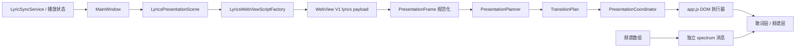

# TaskbarLyrics 歌词呈现引擎

> 文档状态：基于当前 WebView2 主版本实现维护  
> 适用对象：修改歌词显示、翻译、检索提示、频谱切换和相关动画的开发者与 AI 代理  
> 术语说明：“歌词呈现引擎”是一个架构边界，不要求所有能力集中在名为 `Engine` 的单一类中

## 1. 定位

歌词呈现引擎负责把宿主提供的“目标画面”转换成任务栏歌词区域中的稳定 DOM 状态和可中断过渡。调用方声明要展示什么，引擎根据当前画面和目标画面决定如何更新。

它解决以下问题：

- 单行歌词、翻译对、检索提示、普通消息和频谱使用统一的状态语言。
- 高频进度更新不会重复触发整段动画。
- 快速切歌或状态反转时，旧定时器、动画帧和 `transitionend` 回调不会覆盖新画面。
- 检索到频谱的跨层翻滚不需要把频谱伪装成歌词行。
- Windows 减少动态效果开启时可以直接得到最终画面。

歌词呈现引擎不负责：

- 歌词检索、匹配、解析、缓存或歌曲身份决策；这些属于 `TaskbarLyrics.Core`。
- SMTC 会话选择、播放位置外推、系统音频捕获或频谱计算。
- WPF 窗口定位、任务栏附着、DPI/物理像素换算或多显示器窗口创建。
- 设置持久化、托盘命令或其他 WebView 页面。

## 2. 结构与数据流



| 组件 | 职责 | 不应承担的职责 |
| --- | --- | --- |
| `LyricsPresentationScene` | App 内部强类型场景及稳定 wire 值 | 动画选择、文案、DOM 操作 |
| `LyricsSearchingPresentationPolicy` | 从 `TrackInfo` 生成检索双行元数据与提示 | Core 检索、场景动画选择、DOM 操作 |
| `LyricsWebViewScriptFactory` | 生成 V1 消息并约束数值边界 | 判断当前应播放哪种动画 |
| `presentation.js` | 帧规范化、纯转换规划和转场资源所有权 | 直接操作歌词 DOM、读取业务服务 |
| `app.js` | 消费计划并执行歌词、封面和频谱 DOM 更新 | 重新建立第二套场景或转场选择规则 |
| `style.css` | 布局和 transform/opacity 终态 | 业务状态判断、计时器管理 |

## 3. 展示帧

展示帧是当前或目标画面的规范化快照。核心字段如下：

| 字段 | 含义 |
| --- | --- |
| `scene` | `searching`、`lyrics`、`spectrum` 或 `message` |
| `layout` | `single` 或 `translationPair` |
| `current` / `next` | 当前行和下一行 |
| `currentTranslation` / `nextTranslation` | 当前及下一行翻译 |
| `currentLineIndex` | 当前歌词行索引；非歌词场景通常为 `-1` |
| `progress` | 当前行进度，规范化到 `0～1` |
| `wordScanProgress` | 可选逐词扫描进度，规范化到 `0～1` |
| `trackId` | 稳定曲目身份，用于区分同一行更新与切歌 |
| `isPlaying` | 当前播放状态 |
| `isPureMusic` | 兼容现有 payload 的频谱相关标志 |

### 3.1 场景

| 场景 | 用途 |
| --- | --- |
| `searching` | 新曲目歌词检索或重新检索阶段 |
| `lyrics` | 有稳定歌词行索引的普通歌词或翻译歌词 |
| `spectrum` | 当前显示目标是频谱层 |
| `message` | 无播放倒计时、未找到歌词、错误和普通状态提示 |

App 侧场景是规范来源。JavaScript 对缺少 `scene` 的旧消息仍保留安全推断，但兼容分支不能成为新增功能的状态来源，也不能使用 UI 文案作为持久协议标识。

### 3.2 布局

- `single`：当前行和下一行组成普通双行轨道。
- `translationPair`：原文与翻译作为一个逻辑组推进，使用独立的翻译对过渡时长。

布局表示内容结构，不表示动画。调用方不应通过布局字段要求某个具体 CSS 效果。

### 3.3 检索双行

`searching` 场景的内容由 App 宿主从当前 `TrackInfo` 生成：第一行是“歌曲名 - 歌手”，歌手为空时只显示歌曲名并省略分隔符；第二行固定为 `LyricSyncService.SearchingText`（“正在检索歌词...”）。标题/歌手仅在该场景替换，歌词、翻译、普通提示和频谱沿用各自目标帧内容。

检索双行不是新的 V1 消息类型，仍使用同一个 `lyrics` envelope 和 `scene` 字段。Web 生命周期依据当前帧与目标帧的 `scene` 判断检索停留、`searching → lyrics` 翻滚和 `searching → spectrum` 跨层翻滚，不再把第一行文案当作状态标识。旧 payload 缺少 `scene` 时，`createPresentationFrame` 仍可按历史检索文案推断；新调用方必须显式发送场景。

## 4. 转换规划

`PresentationPlanner.plan(currentFrame, targetFrame, options)` 是无 DOM 依赖的纯决策入口。当前计划类型如下：

| 计划 | 当前用途 |
| --- | --- |
| `progressPatch` | 同一展示身份仅更新进度、逐词进度或不变内容 |
| `replaceInPlace` | 同一歌词身份的文字修正、布局切换或同一检索状态内容变化 |
| `singleRoll` | 普通歌词换行、进入检索或普通消息变化 |
| `translationPairRoll` | 带翻译歌词组推进，或检索进入翻译歌词 |
| `searchingToSpectrumRoll` | 检索提示跨层翻滚到频谱 |
| `layerSwitch` | 其他歌词层与频谱层切换 |
| `immediate` | 调用方明确禁用动画、强制立即应用或减少动态效果 |

主要规划规则：

1. `forceImmediate`、`animateTransition === false` 或减少动态效果优先生成 `immediate`。
2. `searching → spectrum` 生成 `searchingToSpectrumRoll`；其他进入或离开频谱的场景生成 `layerSwitch`。
3. 非检索场景进入 `searching` 使用 `singleRoll`；同一检索场景只做补丁或原地替换。
4. 曲目身份和行索引相同的歌词帧，内容不变时做 `progressPatch`，文字或布局变化时做 `replaceInPlace`。
5. 不同歌词行按目标布局选择 `singleRoll` 或 `translationPairRoll`。
6. `searching → lyrics` 同样按目标布局选择单行或翻译对翻滚。
7. 普通消息文字发生变化且允许动画时使用 `singleRoll`；无播放倒计时由宿主明确请求立即应用，因此数字在原位更新。

不要在 `app.js` 的 DOM 执行函数中重新复制这张决策表。新增转换规则应先进入 Planner，并通过纯逻辑测试固定。

## 5. 转场生命周期

`PresentationCoordinator` 是转场资源的唯一所有者，维护：

- `currentFrame`：最近完成并稳定显示的帧。
- `activeTransition`：当前活动转场及其 generation。
- `pendingFrame`：活动转场期间最后收到的目标帧；采用 latest-frame-wins，不积累历史队列。
- fallback timer：WebView2 未触发 `transitionend` 时保证转场能够收尾。
- 活动 `requestAnimationFrame` ID。
- `transitionend` 监听器清理函数。

生命周期规则：

1. 开始新转场前取消旧转场并递增 generation。
2. rAF、兜底定时器和事件监听器回调执行前检查 generation。
3. 完成或取消时统一释放定时器、rAF 和监听器。
4. 转场结束后提交完整目标帧，不能在 finalize 阶段重新猜测场景或丢失 `trackId`、布局和翻译信息。
5. 活动转场期间的普通帧只保留最新一帧；曲目切换、无播放立即更新和频谱场景反转可以中断旧转场。

检索最短停留和频谱等待是内容调度时间，不是 CSS 转场兜底时间，因此由 `app.js` 中两个独立定时器管理：

- `delayedFrameTimer`：真实歌词等待检索最短停留结束。
- `spectrumEntryTimer`：频谱目标等待检索最短停留结束。

两个定时器不能复用同一个含义不明的槽位。歌词结果与频谱目标互相替代时，必须取消对方的等待任务。

## 6. 当前时序与视觉约束

| 行为 | 当前时长 | 说明 |
| --- | ---: | --- |
| 检索最短可见时间 | `900ms` | 重复目标帧按剩余时间重排，不能提前越过 |
| 普通单行翻滚 | `560ms` | `cubic-bezier(0.22, 0.72, 0.24, 1)` |
| 翻译对翻滚 | `760ms` | 原文和翻译作为一组推进 |
| 检索到频谱 | `520ms` | 使用一个真实 `--line-pitch` 的跨层翻滚 |
| 普通层切换 | `300ms` | 歌词层与频谱层的兼容切换 |

检索到频谱的执行顺序：

1. 保持检索提示，不写入“纯音乐”或“暂未找到歌词”等中间终态文字。
2. 歌词层位于当前位置；频谱层以内联样式预置在下方一个 `linePitch` 且透明。
3. 强制读取一次布局，注册转场监听器并进入 `spectrum-transitioning`。
4. 由 Coordinator 持有的下一帧回调移除预定位行内样式，让 CSS 终态驱动歌词上移淡出、频谱上移淡入。
5. 完成或兜底收尾时清除临时 class 和行内样式，提交 `spectrum` 目标帧。

频谱稳定显示后离开到 `searching`、`lyrics` 或 `message` 时，使用同一 `layerSwitch` 计划但采用相反方向：

1. 保持 `spectrum-mode`，先通过不提交场景的内容渲染入口将目标帧写入隐藏歌词层，并把歌词层预置在正的 `--line-pitch` 位置。
2. Coordinator 持有的下一帧加入 `spectrum-exit-active`，歌词层向 `0` 上移，频谱层向负的 `--line-pitch` 上移并淡出。
3. 转场期间只保留最新目标帧；频谱反向到达、减少动态效果或显式 `animateTransition = false` 会取消转场并清理 class、rAF、监听器和行内样式。
4. 完成后提交最新目标帧；如果期间经过检索场景，仍从完成时刻重新计算既有 `900ms` 检索停留，避免和歌词内部翻滚同时启动。

动画只修改 `transform` 和 `opacity`。不得为该效果动画化 `top`、`left`、`height`、`width`，也不得把频谱插入歌词轨道伪装成下一句歌词。

`--line-pitch` 来源于运行时行高和行距计算，不得改回固定像素位移。CSS 和 JavaScript 都必须遵守 `prefers-reduced-motion: reduce`；减少动态效果时立即切换到最终画面。

## 7. 宿主与 WebView 协议

歌词消息继续使用 V1 envelope：

```json
{
  "version": 1,
  "type": "lyrics",
  "payload": {
    "scene": "lyrics",
    "current": "当前歌词",
    "next": "下一句歌词",
    "progress": 0.42,
    "currentLineIndex": 12,
    "trackId": "稳定曲目身份",
    "isPureMusic": false,
    "isPlaying": true,
    "translationMode": false,
    "animateTransition": true,
    "wordScanProgress": null
  }
}
```

协议约束：

- `scene` 使用 `LyricsPresentationScene.ToWireValue()` 生成的稳定英文值，不使用可见中文文案。
- `progress` 和 `wordScanProgress` 在 C# 边界限制到 `0～1`。
- 未知版本、未知消息类型和错误 payload 必须安全忽略。
- `scene` 是兼容新增字段；旧消息缺少该字段时 JavaScript 可以推断，但新调用方必须显式发送。
- `cover`、`spectrum` 和 `spectrumTuning` 保持独立消息。高频频谱数组不应塞入歌词展示帧。

歌词脚本注入顺序必须保持确定：

```text
bridge.js → state.js → presentation.js → app.js
```

`index.html` 中的 `{{STYLE_CSS}}`、`{{APP_JS}}` 注入标记必须保留。

## 8. 如何扩展

### 8.1 新增一种业务场景

只有当目标画面具有独立、互斥且稳定的业务语义时才新增场景：

1. 在 App 层扩展强类型场景和 wire mapping。
2. 明确 MainWindow 在什么条件下产生该场景。
3. 在 `presentation.js` 中校验并规范化场景。
4. 为新场景与现有场景的必要组合增加 Planner 规则。
5. 复用现有执行器；确有不同 DOM 机制时再新增执行能力。
6. 更新 C# payload 测试、Planner 测试和可观察 Web 行为测试。

文字变化、错误文案调整或倒计时数字变化通常不构成新场景。

### 8.2 在现有场景之间新增动效

如果业务场景没有变化，只是需要新的转换方式：

1. 新增明确命名的 TransitionPlan。
2. 在 Planner 中集中声明触发条件。
3. 在 `app.js` 中增加一个只执行机制的分支。
4. 在 `style.css` 中只使用 transform/opacity，并支持 reduced motion。
5. 证明动画可以被打断，过期回调不会覆盖新帧。

不要让 C# 直接调用 `rollSingleLine()`、`fadeToSpectrum()` 等动画原语。宿主只声明目标帧和必要的立即应用策略。

### 8.3 新增连续更新通道

逐词进度、频谱柱等高频数据应优先使用补丁或独立批量消息：

- 同一歌词身份的进度变化走 `progressPatch`。
- 频谱继续批量传递数组，并由前端统一渲染。
- 不按 DOM 节点逐条发送 WebView 消息。
- 同一时间只保留必要的最新值，避免脚本调用或帧队列无界增长。

## 9. 测试与验收

自动测试至少覆盖：

- Planner 对所有场景、布局和 immediate/reduced-motion 组合的选择。
- 同一句进度补丁、文字修正、单行换句和翻译对换句。
- 曲目切换进入检索，并保留完整场景与曲目身份。
- 重复歌词帧不提前越过 `900ms` 检索停留。
- 检索到频谱不渲染中间终态文字。
- 检索到频谱启动下一帧后，预定位行内样式已交给 CSS 终态。
- 转场中恢复歌词或切歌后，旧 rAF、定时器和事件回调失效。
- 减少动态效果立即应用最终状态。
- V1 payload 的 `scene`、进度范围及缺失字段兼容。

Web 集成测试应优先断言可观察 DOM、class、定时器和最终内容，不把生产内部对象暴露为测试接口。

真实 WebView2 手工检查矩阵：

- 单行歌词、翻译歌词、无歌词、纯音乐、暂停和恢复。
- 检索过程中快速切歌、检索结果与频谱目标互相反转。
- 主窗口及多个显示器镜像窗口。
- Windows 100%、125%、150%、200% DPI。
- `prefers-reduced-motion` 开启与关闭。
- 长歌词、长翻译、隐藏封面和窄任务栏区域。

## 10. 文件索引

| 文件 | 维护重点 |
| --- | --- |
| `TaskbarLyrics.App/LyricsPresentationScene.cs` | App 场景与 wire 值 |
| `TaskbarLyrics.App/LyricsWebViewScriptFactory.cs` | V1 payload 生成与边界值 |
| `TaskbarLyrics.App/MainWindow.xaml.cs` | 从播放/歌词状态产生目标场景并推送消息；检索场景注入双行 |
| `TaskbarLyrics.App/LyricsSearchingPresentationPolicy.cs` | 检索阶段歌曲名/歌手双行策略 |
| `TaskbarLyrics.App/Web/Lyrics/presentation.js` | 帧规范化、Planner 和 Coordinator |
| `TaskbarLyrics.App/Web/Lyrics/app.js` | DOM 执行器、停留调度、封面与频谱渲染 |
| `TaskbarLyrics.App/Web/Lyrics/style.css` | 布局、视觉 Token 和转场终态 |
| `TaskbarLyrics.App/Web/Lyrics/index.html` | 歌词层、频谱层和固定 DOM 结构 |
| `TaskbarLyrics.App.Tests/LyricsWebViewScriptFactoryTests.cs` | C# 协议回归 |
| `tests/web/lyrics-layout.test.js` | Planner、生命周期和可观察 Web 行为回归 |

## 11. 维护检查清单

- [ ] 需求由目标场景和内容表达，没有让业务层调用动画原语。
- [ ] Planner 仍是转场选择的唯一来源。
- [ ] Coordinator 仍是 generation、fallback timer、rAF 和转场监听器的唯一所有者。
- [ ] 完成转场时提交完整目标帧，没有重新猜测或丢失身份字段。
- [ ] 高频更新使用补丁或独立批量通道，没有无界队列。
- [ ] 动画仅修改 transform/opacity，支持中断和 reduced motion。
- [ ] WebView V1、注入标记和确定脚本顺序保持兼容。
- [ ] 测试断言可观察行为，没有增加测试专用生产入口。
- [ ] 真实 WebView2、多显示器和 DPI 检查已记录。

本文描述当前 WebView2 主版本。纯 WPF Light 分支不共享这套实现，不能直接假设接口或转场行为一致。
